# Home-Gym Planner — Mini Project Report

## The question this project answers

*"I want to put a treadmill, a squat rack and a bench in my room. Will it all fit — with enough safe space around each piece to actually train?"*

The app lets you enter your room size, place gym equipment in 3D, and see which pieces fit, which collide, and where the ceiling is too low (for example for an overhead press). Every check is built from the geometric tests in the **Basic Geometry** lecture, the equipment is built as meshes following the **Mesh Modeling** lecture, it is lit with my own shader that implements the **Illumination Models & Shading** lecture, and the results are coloured with the HSV model from the **Color** lecture.

**How it differs from the homework (nanorender):** the homework is a viewer for *one* loaded model. This project is a scene with *many* objects, and its main job is to *measure* the space between them and give an answer (fits / does not fit). It is written in TypeScript and runs in the browser.

**Tools:** TypeScript, Vite (dev server), three.js (WebGL drawing and camera orbit only).

---

## Part 1 — The room

### Approach
- The room is described by three numbers, `length` (X), `width` (Z) and `height` (Y), in **centimetres** (1 unit = 1 cm), stored in a `Room` object (`src/room.ts`). Using real units from the start means every later distance check prints a number the user understands ("12 cm to the ceiling").
- The room's corner sits at the origin, so the floor is the rectangle `0..length × 0..width` on `y = 0` and the ceiling is the plane `y = height`. Later parts use exactly these planes for the point–plane distance test (Basic Geometry, slide 20).
- Only the two back walls are drawn solid; the front walls and ceiling are drawn as an outline, so the inside of the room is never hidden.
- A floor grid with one line every 50 cm lets the reader estimate sizes directly from a screenshot.
- Three sliders change the size. On every change the room's meshes are thrown away and rebuilt (simple, and fast enough for a handful of meshes).
- Camera: a perspective camera (the same idea as the perspective projection I built in hw3) with three.js `OrbitControls` to orbit/zoom/pan. I deliberately used the library here: camera navigation was already implemented by hand in hw3, so re-writing it would repeat the homework instead of adding something new.

### Result

*Default room: 400 × 350 × 250 cm. Each grid square is 50 × 50 cm.*

*The same view after changing length to 600 cm and height to 320 cm with the sliders.*

### Limitations
- The surfaces use a flat colour with no lighting yet (`MeshBasicMaterial`); this is replaced by my own Phong shader in Part 2.
- The room is always a rectangular box — no L-shaped rooms, doors or windows.
- The camera does not re-frame itself when the room grows; the user zooms out with the mouse wheel.

---

## Part 2 — Our own Phong shader

### Approach
Instead of using three.js's ready-made lit materials (which hide the math), the floor and walls are drawn with **our own GLSL shader** (`src/phong.ts`) that implements the Phong reflection model from the *Illumination Models & Shading* lecture. Every variable has the slide's name, so each line can be matched to a slide:

| Slide | Formula | In the shader |
|---|---|---|
| 13 – Notation | `l`, `n`, `v`, `r` unit vectors | `l = normalize(lightPos − p)`, `v = normalize(cameraPosition − p)`, `r = reflect(−l, n)` |
| 14 – Ambient | `I_a = L_a k_a` | `vec3 I_a = L_a * k_a;` |
| 17 – Diffuse | `I_d = k_d (l·n) L_d` | `vec3 I_d = k_d * max(dot(l, n), 0.0) * L_d;` |
| 20 – Specular | `I_s = k_s (r·v)^α L_s` | `I_s = k_s * pow(max(dot(r, v), 0.0), alpha) * L_s;` |
| 22 – Total | `I = I_a + I_d + I_s`, "beware of overflows" | sum of the enabled terms, then `clamp(I, 0, 1)` |

Design decisions:
- **One point light** (slide 9, "point source") hangs 10 cm below the ceiling, like a ceiling lamp; sliders move it along X and Z. The same lamp will later be an obstacle for the overhead-press check.
- **Light (`L_a, L_d, L_s`) vs material (`k_a, k_d, k_s, α`)** are kept separate, as on slide 13: the light values live in one shared `lightUniforms` object used by every material, and each surface has its own coefficients. The walls are matte paint (`k_s = 0`); the floor is a slightly shiny rubber gym floor (`k_s = 0.35`, `α = 20`) so the specular term is visible.
- **Everything is computed in world space.** The surface point, the normal, the light position and the camera position are all converted to world coordinates before any dot product. At the end of hw5 my renderer had an unresolved bug: triangles came out almost black because the face normals and the light direction were in different coordinate spaces. Here I avoided that by converting every vector to the same space before using it.
- **Normals are transformed with the inverse-transpose of the model matrix**, so they stay perpendicular to the surface even if an object is scaled unevenly.
- The lighting is evaluated **per pixel**, in the fragment shader. Part 5 adds a Gouraud (per-vertex) mode so the two can be compared, as on slides 25–29.
- **Checkboxes** switch each term on and off, which produced the comparison images below.

**Relation to the homework:** hw5 implemented the same model on the CPU inside nanorender's rasterizer loop. Here it runs on the GPU as a shader, and is the base for the Gouraud vs Phong comparison (which hw5 did not have).

### Result

*Top left: ambient only — every surface has one flat color, "looks like a silhouette" (slide 14). Top right: adding diffuse — surfaces closer to and facing the lamp are brighter (Lambert, slide 17). Bottom left: specular only — the shiny floor shows a highlight where the reflected ray points toward the camera; the matte walls stay black (`k_s = 0`). Bottom right: the full model.*

*Moving the lamp to 15% / 20% of the room: the walls next to it become brighter and the floor highlight moves, because `l` changes for every pixel.*

### Limitations
- The light has **no distance falloff**: the slides' local model does not include attenuation, so a far wall is lit only through the angle `l·n`, not the distance.
- **No shadows**: this is a local illumination model (slide 7), so equipment will not cast shadows on the floor.
- The specular term "has no real physical basis" (slide 20) — it is a good-looking approximation, not a measurement of light.

---

## Part 3 — Equipment meshes

### Approach
Five pieces of equipment are **built in code** as triangle meshes (`src/mesh.ts`, `src/equipment.ts`) instead of being loaded from OBJ files. This keeps the project free of third-party 3D models (no licence issues) and lets every vertex be explained.

- **Data structure — face-vertex (Mesh lecture, slide 8):** each mesh is a *vertex list* (coordinates) and a *face list* (three vertex indices per triangle) — `interface FVMesh { vertices; faces }`. It is the same structure our hw2 OBJ loader produced, so the rest of the pipeline is familiar.
- **Two building blocks:**
  - `addBox(...)` — 6 sides, 2 triangles each (a quad split into triangles, slide 2). Each side has **its own 4 vertices**, so corner vertices are *not* shared between sides. This is the "normals per-vertex-per-face" idea from Shading slide 27: a box must keep sharp edges, so a corner needs a different normal on each side.
  - `addCylinder(...)` — a ring of quads around the axis plus two caps made of a fan of thin triangles. Here the **rim vertices are shared** by the round side and the flat cap, so the mesh is closed ("watertight"), like most OBJ files.
- **Outward-facing triangles:** a face normal is the cross product of two edges, `N = (v_j − v_i) × (v_k − v_i)` (Basic Geometry, slide 8). Because the cross product is anti-commutative, the vertex order decides which way `N` points. `addTriangle` compares `N` with the known outward direction and swaps two vertices if needed, so every face points out of the object.
- **Vertex normals** are computed as the **plain average** of the incident face normals (Mesh slide 11) — the same method as in hw3/hw5. Part 4 compares it with the area-weighted average.
- **Equipment = size + parts.** Each catalogue entry stores the outer size (length × width × height) and a list of parts, each with one Phong material (painted steel, chrome, red leather, black plastic, belt, rubber mat). The size is the box the fit and collision checks will use from Part 7 on. Each piece's local origin is the centre of its footprint on the floor, which will make moving and turning it in Part 6 simple.

| Equipment | Box (L × W × H, cm) | Built from |
|---|---|---|
| Treadmill | 180 × 80 × 140 | frame boxes, belt, 2 rollers + 2 handrails (cylinders), console |
| Squat rack | 120 × 130 × 215 | 4 posts, top bars, feet (boxes), barbell + 2 plates (cylinders) |
| Bench | 120 × 50 × 45 | pad, spine, legs, feet (boxes) |
| Exercise bike | 100 × 55 × 120 | stabilisers, beam, posts, seat (boxes), flywheel + handlebar (cylinders) |
| Yoga mat | 180 × 60 × 1 | one thin box |

The sizes are typical catalogue sizes, not one specific product.

**Relation to the homework:** the homework only *loaded* meshes (hw2) and computed their normals (hw3). Here the meshes are *generated*, which required deciding which vertices to share and in which order to list them.

### Result
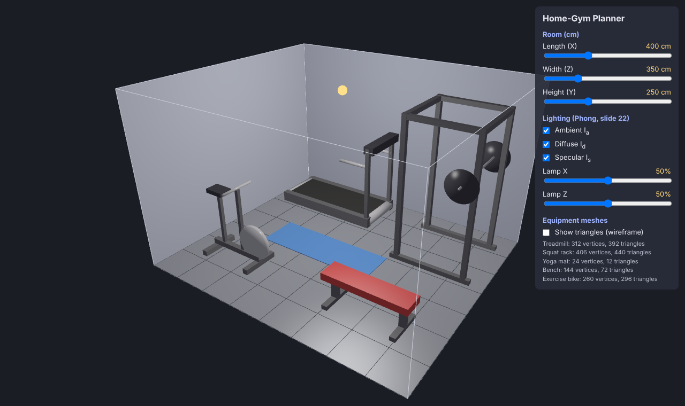

*Default layout. The chrome bars and plates show small sharp highlights (`α = 120`), the red pad a soft wide one (`α = 15`) — the shininess coefficient from slides 20–21.*

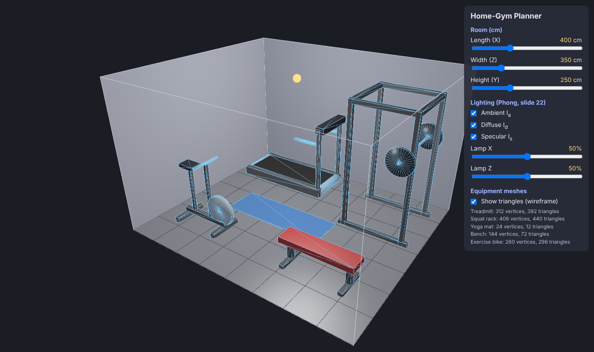

*"Show triangles" draws every edge of the meshes. The panel lists the size of each mesh (for example, the squat rack: 406 vertices, 440 triangles). The cap fans of the plates and the flywheel are visible as "spokes".*

### Limitations
- The equipment is simplified: straight boxes and round cylinders only (no curved frames, cables or screens).
- The layout is fixed for now (designed for a 400 × 350 cm room). If the room is made smaller, equipment can stick out of the walls — nothing checks this yet (Part 7).
- With plain-average normals, a vertex on a cylinder rim gets a normal tilted between the round side and the flat cap, even though the side is much larger than the thin cap triangles. Part 4 examines this and compares it with area weighting.

---

## Part 4 — Area-weighted vertex normals

### Approach
Mesh slide 11 says vertex normals are "not even defined" and that there is "no correct answer", only estimates. It gives two:
1. **Plain average** of the normals of the faces around the vertex (what hw3/hw5 and Part 3 used).
2. **Weighted average**, where each face normal is weighted by the **face's area** — the slide's answer to "what if some faces are larger than others?".

Our cylinders are exactly that case: a vertex on the rim of a cylinder touches **3 long side triangles** and **2 thin cap triangles** (see the "spokes" in the Part 3 wireframe). With the plain average, every triangle counts the same, so the result depends on *how many* triangles of each kind there are, not on how big they are.

Implementation (`vertexNormalsAreaWeighted` in `src/mesh.ts`): the length of the cross product of two edges is twice the triangle's area,
`|(v_j − v_i) × (v_k − v_i)| = 2 · Area`,
so adding the cross product **without normalizing it** already weights each face by its area. The area-weighted function is identical to the plain one except for one missing `.normalize()`.

UI additions:
- a selector **Plain average / Area-weighted average** that recomputes the normals of every part and uploads only the normal buffer to the GPU (positions and faces stay the same);
- **Show vertex normals**: short yellow lines from every vertex along its normal (the same debug idea as hw3 Part 4);
- **Look at**: moves the camera to one piece, so close-ups are repeatable for the report.

**Relation to the homework:** hw3 computed vertex normals with the plain average only. This part adds the weighted version from the slide and shows, on our own meshes, *when* the two give different results.

### Result
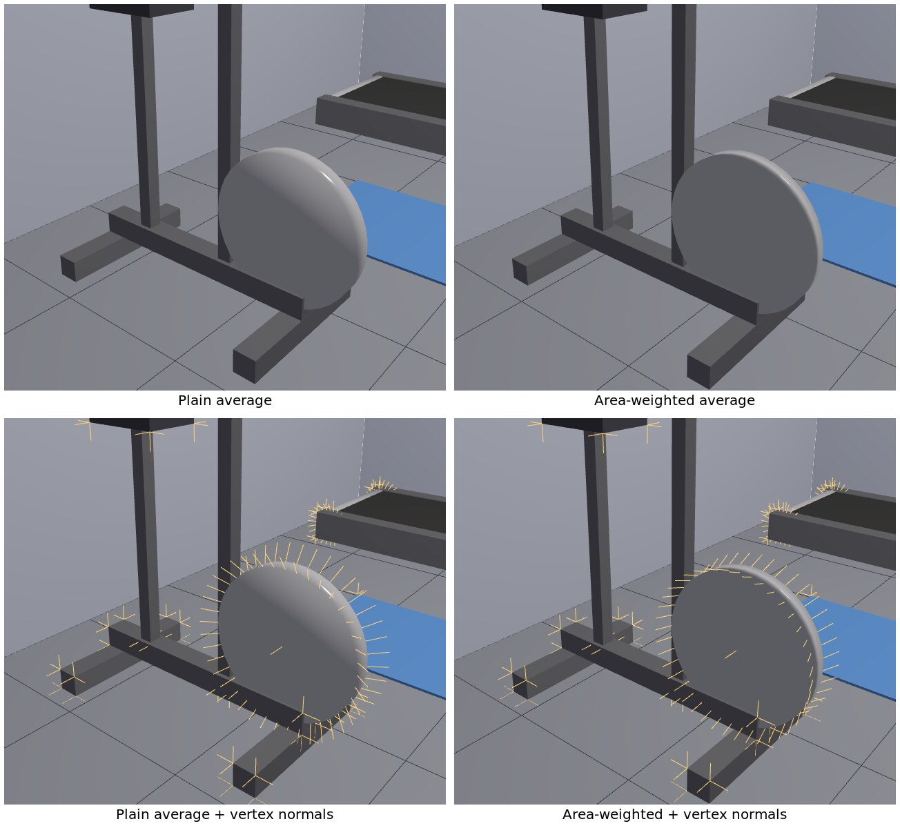

*The flywheel is a flat disc 6 cm thick with radius 25 cm, so its two caps are much bigger than its thin rim. **Plain average (left):** the rim normals lean far out to the side (bottom-left, yellow lines), so the flat face is shaded like a dome, with a highlight band across it. **Area-weighted (right):** the big cap triangles dominate, the rim normals point almost straight out of the face, and the disc looks flat, as it is.*

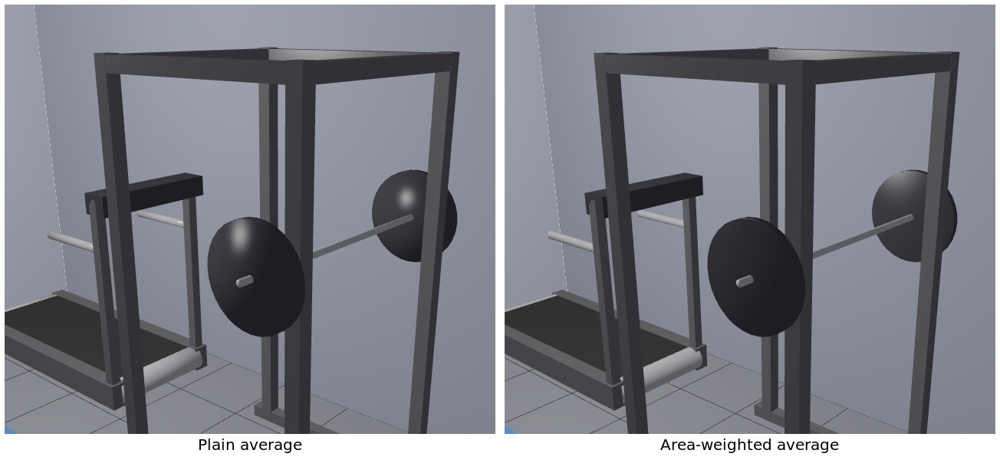

*Same effect on the 4 cm thick plates: with the plain average they look like round "pillows"; area-weighted they look like flat plates.*

**What did not change:** boxes look the same with both methods, because each side of a box has its own vertices (Part 3), so every vertex touches only triangles of one flat side. The long thin cylinders (rollers, handlebar, barbell) also change very little: there the big side triangles already outnumber the cap triangles.

### Limitations
- Area weighting is still an estimate, not "the" correct normal. On the flywheel it makes the flat face correct, but now the thin round edge is shaded almost as if it were flat too. The truly correct fix for a sharp rim is to **not share** the rim vertices between the side and the cap (per-vertex-per-face normals, Shading slide 27), as I already do for boxes. I kept the shared rim on purpose to be able to show this comparison.
- Area-weighted is the default from now on.

---

## Part 5 — Gouraud vs Phong shading

### Approach
The Shading lecture separates **lighting** (the illumination equation, Part 2) from **shading** (where that equation is evaluated, slide 4). Slides 25–29 compare two answers:

| | **Gouraud** (slides 25, 28) | **Phong shading** (slide 29) |
|---|---|---|
| Equation evaluated | once per **vertex** | once per **pixel** |
| What is interpolated over the triangle | the resulting **color** | the **normal** (then renormalized) |
| Where in our code | vertex shader → `vGouraudColor` | fragment shader → `normalize(vWorldNormal)` |

Implementation (`src/phong.ts`):
- The illumination equation was moved into one GLSL function, `phongIllumination(p, n)`, that is pasted into **both** shaders. The two modes therefore use exactly the same math — the only difference is *where* it runs.
- A shared switch `useGouraud` (dropdown **Shading**) chooses the mode. In Gouraud mode the vertex shader computes the color and the GPU interpolates it linearly across the triangle (slide 28); in Phong mode the fragment shader renormalizes the interpolated normal and computes the color per pixel (slide 29).
- To answer slide 28's question — *"Can Gouraud shading support specular lighting?"* — a second dropdown, **Floor triangles**, rebuilds the floor with 2, 128 or 2048 triangles. The floor is the shiniest large surface in the scene.

**Relation to the homework:** hw5 implemented flat shading and Phong shading but not Gouraud. This part adds the missing method and compares the two on the same scene.

### Result
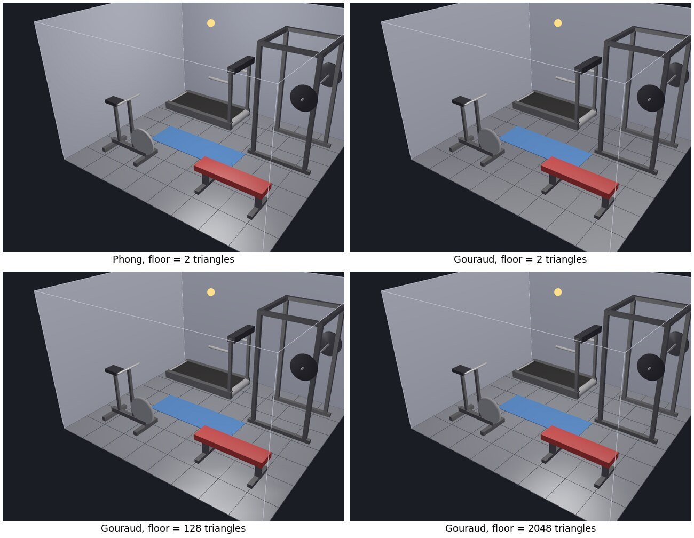

*Top left — Phong shading, floor of only 2 triangles: the specular highlight is round and in the right place, because the equation is evaluated at every pixel. Top right — Gouraud, same 2 triangles: **the highlight disappears**. The light is computed only at the 4 floor corners, none of which is near the highlight, and interpolating those 4 dull colors cannot create a bright spot in the middle. Bottom — Gouraud with 128 and 2048 triangles: the highlight comes back once there are vertices close enough to it, and with 2048 triangles it is close to the Phong result.*

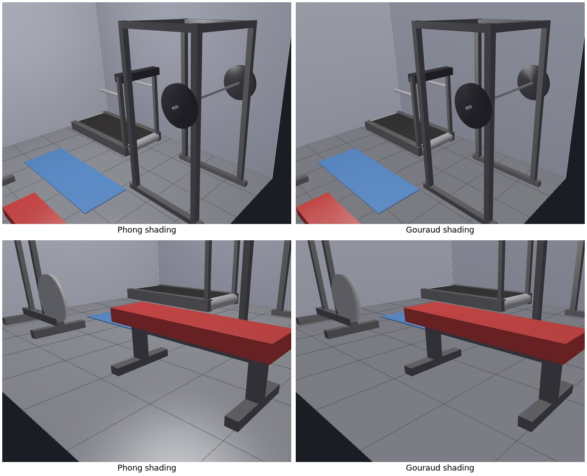

*The same effect on the equipment: with Phong shading the black plates and the red pad show highlights; with Gouraud the plates look almost matte and the highlight on the floor in front of the bench is gone.*

**Answer to slide 28's question:** Gouraud *can* show specular light, but only where the highlight falls on (or very near) a vertex. For a small, sharp highlight (large `α`) on large triangles it misses it completely. Phong shading does not depend on the mesh resolution, at the cost of running the equation for every pixel instead of every vertex.

### Limitations
- Gouraud makes the equipment look slightly duller overall; that is the method, not a bug, but it means screenshots from the two modes are not directly comparable in brightness.
- The floor tessellation choice affects only the floor; the equipment meshes keep their resolution.
- Phong shading is the default because the planner runs comfortably in real time with it on this scene (a few thousand triangles).

---

## Part 6 — Placing, moving and turning equipment

### Approach
This is where the viewer becomes a planner: pieces can be **selected with the mouse, dragged across the floor, turned by 90°, added and deleted**. Each placed piece is a `PlacedItem` (`src/placement.ts`): its type, the centre of its footprint `(x, z)` in cm, and `turned` (0° or 90°). `itemBox()` turns this into the piece's axis-aligned box — the same box that is outlined in yellow when the piece is selected, and the box all checks in Parts 7–9 will use.

All the mouse work is done with the line and plane formulas from the *Basic Geometry* lecture (`src/geometry.ts`):

1. **The mouse as a line (slide 15).** The pixel under the mouse is turned into a line through the camera in *parametric form*, `f(t) = (1 − t)·P1 + t·P2`, where `P1` is that pixel on the near plane and `P2` the same pixel on the far plane. (`unproject` is the inverse of the perspective projection I wrote in hw3.)
2. **Picking — what did the user click?** Two steps, following the *Collision Detection* slide (21: "needs to be efficient and accurate"):
   - *Quick reject:* every piece is wrapped in a bounding sphere, and the line is tested with the **line–sphere test of slide 24** ("find distance from line to center of sphere; if it is less than R, there is an intersection"). The distance itself is the **point–line distance of slide 16**, `‖QP1 × QP2‖ / ‖P1P2‖`.
   - *Exact test:* for the pieces that pass, the line is tested against the piece's box. `lineBoxT` intersects the line with the plane of each of the 6 sides (**line–plane intersection** with the plane equation `Ax + By + Cz + D = 0` of slide 20) and checks whether the point lies inside that side's rectangle. The piece whose box is entered first (smallest `t`) is the one nearest the camera.
3. **Dragging.** While the button is held, the mouse line is intersected with the **floor plane** `y = 0` (`n = (0, 1, 0)`, `D = 0`, slide 20). The piece's centre follows that point (keeping the offset of where it was grabbed), rounded to 5 cm so positions are easy to read. The camera is frozen during a drag.
4. **Turning** swaps the footprint's length and width and rotates the meshes by 90° around the piece's centre. Arrow keys move the selection in 5 cm steps (like the arrow-key translation in hw2), `R` turns and `Delete` removes.

**Why both a sphere and a box?** The first version used only bounding spheres. Testing it by clicking 9 points in the scene, 3 clicks selected the wrong piece — for example, clicking the treadmill belt selected the yoga mat, because the flat mat's sphere (radius ≈ 95 cm) reaches far above the mat. With the exact box test added, all 9 test clicks selected the right piece. The sphere is kept as the cheap first step.

**Relation to the homework:** hw2–hw3 moved one model with sliders and keys in its own coordinate frame. Here the user manipulates several objects directly in the 3D view, which needs the inverse direction: from a 2D pixel back to a 3D line, and from that line to a point on the floor.

### Result
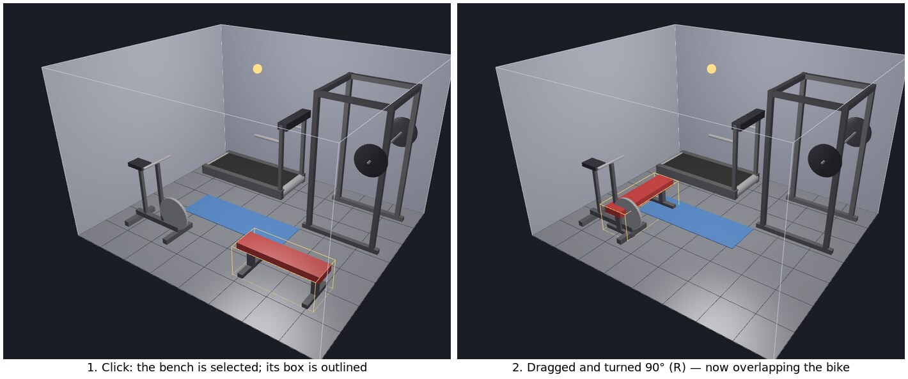

*Left: clicking the bench selects it; the yellow outline is its 120 × 50 × 45 cm box, and the panel shows its centre. Right: the bench dragged to the left and turned 90° (now 50 × 120 cm). It now overlaps the exercise bike — nothing checks that yet; Part 8 will.*

### Limitations
- Only 90° turns. Free rotation would make the boxes non-axis-aligned and need a different overlap test that is not in the lectures.
- Picking uses each piece's whole box, so clicking the empty space *inside* the squat rack frame selects the rack, not the piece behind it.
- Pieces can be dragged through walls and out of the room on purpose — the planner should *show* the problem rather than hide it (Part 7).

---

## Part 7 — Does each piece fit in the room?

### Approach
This is the first part that answers the project's question. Each wall and the ceiling is a **plane** `A·x + B·y + C·z + D = 0` with normal `n = (A, B, C)` (Basic Geometry, slide 20), chosen so that `n` points **into** the room (`src/checks.ts`):

| Plane | n | D | "inside" means |
|---|---|---|---|
| left wall | (1, 0, 0) | 0 | x ≥ 0 |
| right wall | (−1, 0, 0) | length | x ≤ length |
| back wall | (0, 0, 1) | 0 | z ≥ 0 |
| front wall | (0, 0, −1) | width | z ≤ width |
| ceiling | (0, −1, 0) | height | y ≤ height |

For every piece, the **8 corners** of its box are measured against every plane with the **point–plane distance** of slide 20, `D = (w·n + d) / ‖n‖`. The slide takes the absolute value; I keep the **sign**, because with inward normals the sign tells which side the corner is on: positive = inside, negative = outside. The smallest value over all corners and planes is the piece's **clearance** — how much room is left to the closest wall — and if it is negative, the piece sticks out by that much. The planner also lists *every* plane a piece sticks through (for example a rack that is both too long and too tall).

Visual feedback for each piece:
- its box outline and its footprint on the floor in a **status colour**;
- a short line from the closest corner straight to the closest wall (the perpendicular, `foot = w − dist·n`), with a label showing the distance in cm (the label is placed with the same projection as hw3: 3D point → normalized device coordinates → pixel);
- a line in the panel, e.g. *"Squat rack: ❌ sticks out 40 cm through the right wall (also: ceiling)"*.

**Colour from the HSV model (Color lecture, slide 38).** The status colour is built in HSV, where H is the angle around the V axis: **only the hue changes** — from 0° (red, sticking out) through orange and yellow to 120° (green, 20 cm or more of space) — while S and V stay fixed, so every status colour is equally bright and readable on the dark background. `hsvToRgb()` implements the standard conversion (6 sectors of 60°). Doing the same in RGB would mean changing two channels at once and passing through a dull brown in the middle.

The checks run every frame (a few pieces × 8 corners × 5 planes is very cheap), so the colours update live while a piece is dragged or a room slider moves. The checkbox *Show clearance colours & distances* switches all overlays off for a clean view.

**Relation to the homework:** hw3 drew a bounding box only as a debugging aid. Here the box is the input to a real measurement, and the result is the answer the user came for.

### Result
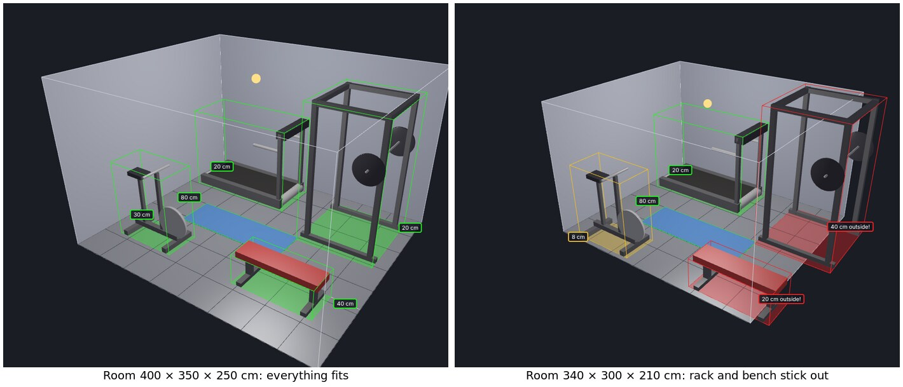

*Left: the default 400 × 350 × 250 cm room — every piece is green, with 20–80 cm to its closest wall. Right: the same layout in a 340 × 300 × 210 cm room. The panel reports:*

| Piece | Result |
|---|---|
| Treadmill | ✔ 20 cm to the left wall |
| Squat rack | ❌ sticks out 40 cm through the right wall (also: ceiling) |
| Yoga mat | ✔ 80 cm to the left wall |
| Bench | ❌ sticks out 20 cm through the right wall |
| Exercise bike | ✔ 8 cm to the front wall (yellow: tight) |

*Hand check: the rack spans x = 260…380 cm, so in a 340 cm room it is 380 − 340 = 40 cm outside, and it is 215 cm tall in a 210 cm room (5 cm through the ceiling). The bike spans z = 237.5…292.5 cm, 7.5 cm from the 300 cm front wall (rounded to 8).*

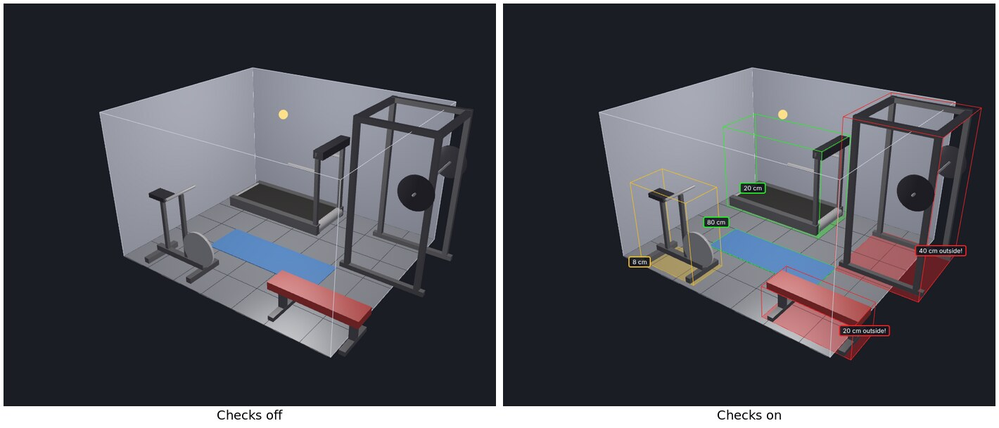

*The same small room with the checks switched off (left) and on (right).*

### Limitations
- The check uses each piece's **box**, not its exact shape, so it is cautious: a piece is reported as touching a wall when only the corner of its box does. For furniture planning, erring on the safe side is acceptable.
- The planner shows the problem but does not move pieces automatically.
- The floor is not checked (pieces always stand on it), and there are no doors, windows or radiators yet.

---

## Part 8 — Overlaps and safety zones

### Approach
Fitting inside the walls (Part 7) is not enough: pieces must not overlap each other, and each one needs **free space around it to be used safely**. This part adds both checks.

**1. Overlap between pieces — "collision of static primitives" (Basic Geometry, slide 21).** The slide reduces collision detection to a simpler problem: *check if two primitives intersect; the answer is only yes/no.* For two axis-aligned boxes this is very simple (`boxOverlap` in `src/checks.ts`): they intersect only if their ranges overlap on **all three axes**, and on each axis the overlap is `min(maxA, maxB) − max(minA, minB)`. Every pair of pieces is tested. The smaller of the X and Z overlaps is reported as the *depth* — how far one piece has to slide to separate them.

**2. Safety zones.** Every equipment type now has a `zone`: the free space it needs on its front, back and sides (`src/equipment.ts`).

| Equipment | Front | Back | Each side | Source |
|---|---|---|---|---|
| Treadmill | 0 | **200 cm** | **50 cm** | ASTM F2115 treadmill standard (2 m behind the running surface, 0.5 m each side) |
| Squat rack | 60 cm | 0 | 30 cm | assumption: step out with the bar, load plates |
| Bench | 30 cm | 30 cm | 60 cm | assumption: sit / lie down from the side |
| Exercise bike | 30 cm | 30 cm | 50 cm | assumption: get on and off |
| Yoga mat | 30 cm | 30 cm | 30 cm | assumption: arms and legs reach past the mat |

Only the treadmill numbers come from a standard; the others are the planner's assumptions, stated here openly and easy to change in one place.

A zone is the piece's box grown by these amounts (`zoneBox` in `src/placement.ts`). It is defined in the piece's **own frame** (front = +X) and rotated with it, using the rotation about the vertical axis `x' = x·cosθ + z·sinθ, z' = −x·sinθ + z·cosθ` — the same rotation that turns the meshes. To make this useful, rotation was extended from 0°/90° (Part 6) to **all four quarter turns**: for a treadmill it matters which end is "behind".

A zone is **blocked** if another piece's box is inside it (the same box-overlap test) or if it crosses a wall (the same signed point–plane test as Part 7, without the ceiling). Zones may overlap *each other* — two pieces can share the same walking space.

**Colours** (all built in HSV with the same S and V, as in Part 7): red = overlapping or outside the room, orange = safety space blocked, green-to-yellow = the Part 7 clearance. Zones are drawn on the floor in light blue when free and orange when blocked. Each problem is listed in words in the panel, and the checkbox *Show safety zones* hides them.

**Example layouts.** A *Load* button switches between two layouts for the default 400 × 350 cm room, so the comparison below is reproducible: the *Starter* layout (placed by eye) and a *Safe* layout (rearranged until every check passed).

**Relation to the homework:** the homework handled a single object, so there was nothing to collide with. Here every pair of objects is tested, and the test is the yes/no static collision of slide 21.

### Result
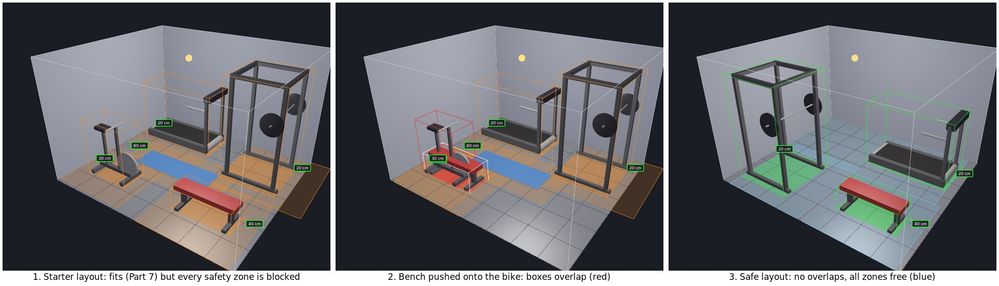

**1. Starter layout.** Every piece fits in the room (all Part 7 checks are green), but the panel lists:

| Problem found |
|---|
| Treadmill needs free space; blocked by the left wall (180 cm short) and the back wall |
| Squat rack needs free space; blocked by the right wall (40 cm short) and the back wall |
| Yoga mat needs free space; blocked by Squat rack, Exercise bike |
| Bench needs free space; blocked by Yoga mat |
| Exercise bike needs free space; blocked by Yoga mat |

*Hand check (treadmill): its box starts 20 cm from the left wall, and it needs 200 cm behind it → 200 − 20 = 180 cm short.*

**2. Bench moved 200 cm to the left** (arrow keys): *"Bench and Exercise bike overlap by 50 cm."* Hand check: the bench spans z = 240…290 and the bike z = 237.5…292.5, so along Z they share the full 50 cm width of the bench (along X they share 90 cm; the smaller value is reported).

**3. Safe layout.** *"No overlaps, every safety zone is free."* The treadmill now runs toward the right wall with its 2 m run-off covering the back half of the room; the rack and bench share the front half.

**What the planner taught us:** in a 4 × 3.5 m room I could only fit three of the five pieces *with* their safety space — the treadmill and its zone alone cover 380 × 180 cm, about half of the floor. I did not find any place left for the bike or the mat (this is a result of trying, not a proof that no arrangement exists). That is exactly the kind of answer the project set out to give before anyone buys equipment.

### Limitations
- Zones are rectangles. Real free space is often rounder (for example, the arc of a kettlebell swing — Part 9 uses a sphere for that).
- Except for the treadmill, the zone sizes are assumptions, not standards.
- The overlap test is for boxes aligned with the room, which is why rotation is limited to quarter turns.

---

## Part 9 — Movements: the kettlebell swing and the overhead press

### Approach
A room can fit every machine and still be unsafe to train in: what matters for some exercises is not the equipment but **the space the body and the weight move through**. Two common home exercises are modelled as simple 3D shapes (`src/reach.ts`), placed with two new "training spots" in the catalogue:

| Movement | Shape | Built from |
|---|---|---|
| Kettlebell swing | **sphere** around the shoulders | centre at shoulder height, radius = arm length + the bell (15 cm) |
| Overhead press | vertical **segment** from the shoulders to the hands at lockout | the bar's plates (radius 22 cm, as on our barbell) must clear everything |

Body sizes come from the user's height `H` (a new slider), using classic anthropometric segment proportions (Drillis & Contini): shoulder height ≈ 0.818·H and shoulder-to-grip ≈ 0.386·H. These are averages, not measurements of the user.

The ceiling lamp from Part 2 is now also an **obstacle**: a sphere of radius 15 cm hanging 20 cm below the ceiling.

The tests, all from the *Basic Geometry* lecture (`src/geometry.ts`, `updateChecks` in `src/main.ts`):

- **Swing sphere vs walls and ceiling** — the signed point–plane distance of the sphere's centre (slide 20) minus the radius: if the centre is closer to a plane than `R`, the bell can hit it.
- **Swing sphere vs lamp** — two spheres touch when the distance between their centres is less than `R₁ + R₂` (the "distance to the centre compared with R" idea of slide 24).
- **Swing sphere vs other pieces** — sphere against box: the box point closest to the centre is found by *clamping* the centre into the box's range, then compared with `R`.
- **Press segment vs ceiling** — the hands' point–plane distance to the ceiling, minus the plate radius.
- **Press segment vs lamp** — the distance from the lamp's centre to the arm **segment**. Slide 16 gives the distance to an infinite *line*; slide 19 warns that for a segment you "need to check end points separately". `pointSegmentDistance` projects the point onto the line (parameter `t`), uses slide 16 when `0 ≤ t ≤ 1`, and the nearest end point otherwise. Here this matters: the lamp is *above* the hands, beyond the end of the segment, so the infinite-line distance would be wrong (it would be the horizontal distance only).

For each movement the smallest gap is shown in the panel (*"✔ 17 cm to the ceiling"* / *"❌ hits the lamp by 18 cm"*), the shape is drawn see-through in the HSV status colour, and every hit is added to the problem list.

**A final verdict** at the top of the panel sums up all checks of Parts 7–9 in one line — either *"✔ This home gym works: everything fits, with room to train"* or *"⚠ N problems — see the lists below"*. This is the one-line answer to the project's question.

**Relation to the homework:** nanorender only drew surfaces. Here the "objects" being checked are not drawn meshes at all but invisible volumes of movement, and the geometry is used to reason about them.

### Result
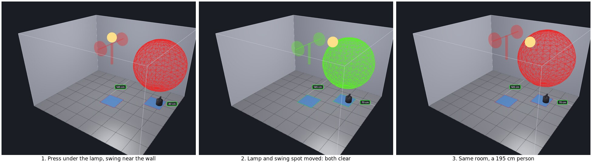

*Layout "Movement demo (Part 9)" in the default 400 × 350 × 250 cm room, person height 175 cm:*

| Step | Overhead press | Kettlebell swing | Verdict |
|---|---|---|---|
| 1. Press right under the lamp, swing 70 cm from the right wall | ❌ hits the lamp by 18 cm | ❌ hits the right wall by 13 cm | ⚠ 2 problems |
| 2. Lamp moved to 70 %, swing spot moved 30 cm left | ✔ 17 cm to the ceiling | ✔ 17 cm to the right wall | ✔ works |
| 3. Same layout, person height 195 cm | ❌ hits the ceiling by 7 cm | ❌ hits the lamp by 1 cm | ⚠ 2 problems |

*Hand check, step 1 (H = 175): shoulders at 0.818 × 175 = 143.2 cm, hands at 143.2 + 0.386 × 175 = 210.7 cm. The lamp's centre is at 250 − 20 = 230 cm, straight above the hands, so the distance to the segment is 230 − 210.7 = 19.3 cm (the end point P2 — slide 19's case). Minus the plate radius 22 and lamp radius 15 gives −17.7 → "hits the lamp by 18 cm". Ceiling: 250 − 210.7 − 22 = 17.3 → "17 cm". Swing: R = 0.386 × 175 + 15 = 82.6 cm, and the centre is 400 − 330 = 70 cm from the right wall → 70 − 82.6 = −12.6 → "13 cm".*

*Step 3 shows why the height slider matters: the same room that works for a 175 cm person does not work for a 195 cm person (hands at 234.8 cm, plates 7 cm into the ceiling).*

### Limitations
- The swing sphere is cautious: a real swing moves mostly in front of the body, not in every direction.
- Body proportions are population averages; a person with long arms needs more space than shown.
- The press only checks the ceiling and the lamp, not other equipment above the head (for example, pressing inside the squat rack under its top bars), and the bar's sideways length is not checked against walls.

---

## Summary

**Question:** *Will my gym equipment fit in my room — with enough safe space around each piece to train?*

**Answer the planner gives:** for the default 4 × 3.5 × 2.5 m room, a treadmill, a squat rack and a bench fit with all their safety space; I could not find room for the bike and the mat as well; and whether an overhead press is safe depends on the lamp's position and on the person's height.

### How the lectures were used

| Lecture | Where | What |
|---|---|---|
| **Illumination Models & Shading** | Parts 2, 5 | Own Phong reflection model (ambient, diffuse, specular, slides 12–22) with on/off toggles; Gouraud vs Phong shading (slides 25–29), answering slide 28's question with a measurement |
| **Mesh Modeling** | Parts 3, 4 | Face-vertex meshes built in code (slide 8); per-vertex-per-face normals for sharp boxes; plain vs area-weighted vertex normals (slide 11) |
| **Basic Geometry** | Parts 6–9 | Parametric line (15), line–plane intersection and point–plane distance (20), point–line distance (16), segment end points (19), line–sphere (24), static collision of boxes (21), cross product for face orientation (8) |
| **Color** | Parts 7–9 | HSV model (slide 38) for status colours that differ only in hue |

### What I would add with more time
- Free rotation of equipment (would need an oriented-box overlap test).
- Doors, windows and radiators as fixed obstacles.
- A search that tries arrangements automatically and suggests one that passes.
- Saving and loading a room to a file.
