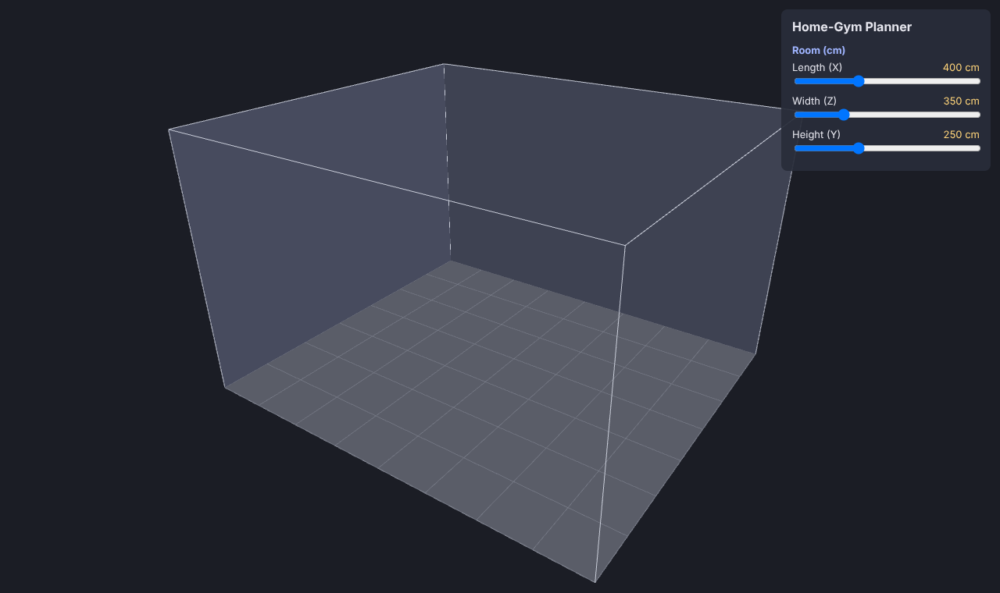
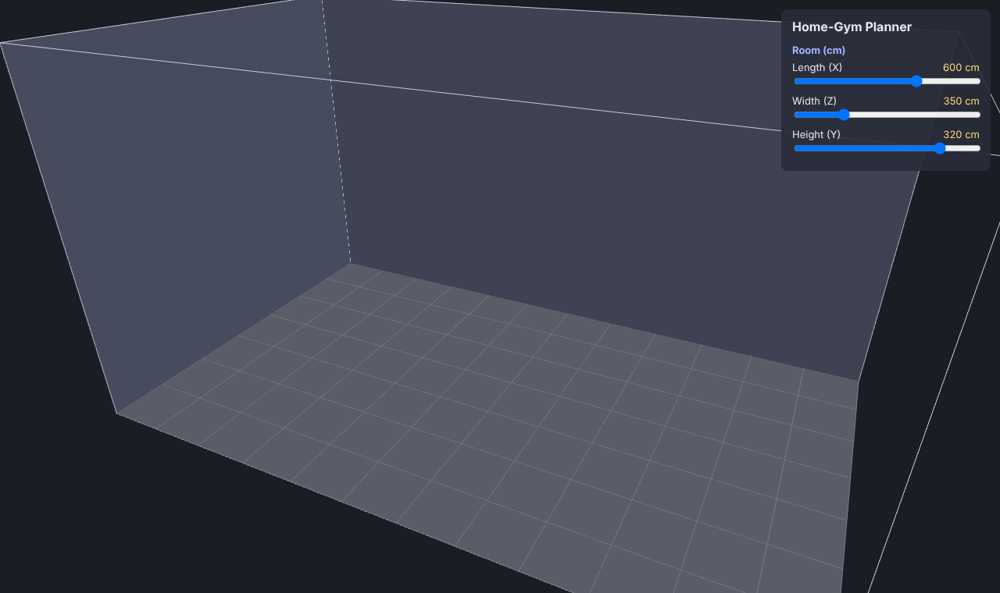
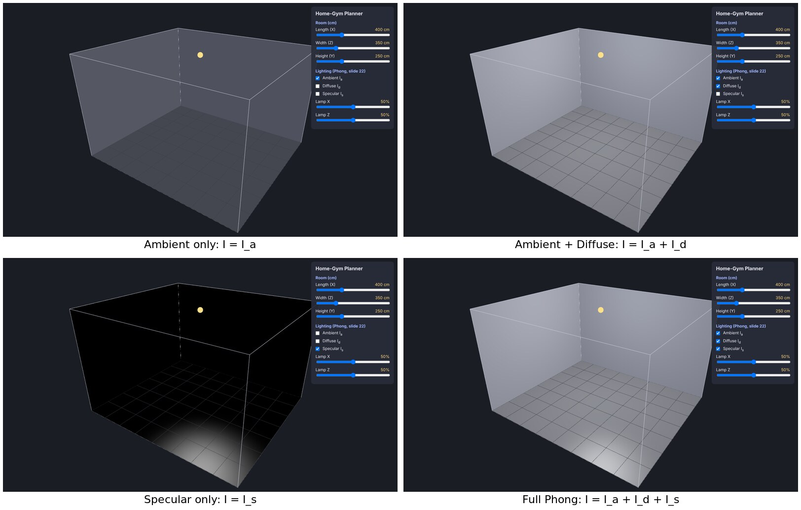
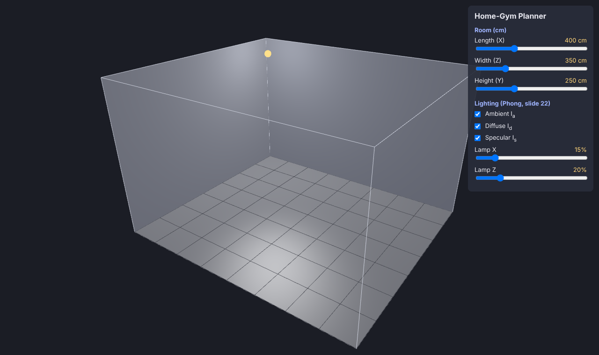

# Home-Gym Planner — Mini Project Report

> **Draft — reword in your own voice before submitting.**

## The question this project answers

*"I want to put a treadmill, a squat rack and a bench in my room. Will it all fit — with enough safe space around each piece to actually train?"*

The app lets you enter your room size, place gym equipment in 3D, and see which pieces fit, which collide, and where the ceiling is too low (for example for an overhead press). Every check is built from the geometric tests in the **Basic Geometry** lecture, the equipment is built as meshes following the **Mesh Modeling** lecture, and it is lit with our own shader that implements the **Illumination Models & Shading** lecture.

**How it differs from the homework (nanorender):** the homework is a viewer for *one* loaded model. This project is a scene with *many* objects, and its main job is to *measure* the space between them and give an answer (fits / does not fit). It is written in TypeScript and runs in the browser.

**Tools:** TypeScript, Vite (dev server), three.js (WebGL drawing and camera orbit only).

---

## Part 1 — The room

### Approach
- The room is described by three numbers, `length` (X), `width` (Z) and `height` (Y), in **centimetres** (1 unit = 1 cm), stored in a `Room` object (`src/room.ts`). Using real units from the start means every later distance check prints a number the user understands ("12 cm to the ceiling").
- The room's corner sits at the origin, so the floor is the rectangle `0..length × 0..width` on `y = 0` and the ceiling is the plane `y = height`. Later parts use exactly these planes for the point–plane distance test (Basic Geometry, slide 20).
- Only the two back walls are drawn solid; the front walls and ceiling are drawn as an outline, so the inside of the room is never hidden.
- A floor grid with one line every 50 cm lets the reader estimate sizes directly from a screenshot.
- Three sliders change the size. On every change the room's meshes are thrown away and rebuilt (simple, and fast enough for a handful of meshes).
- Camera: a perspective camera (the same idea as the perspective projection we built in hw3) with three.js `OrbitControls` to orbit/zoom/pan. We deliberately use the library here: camera navigation was already implemented by hand in hw3, so re-writing it would repeat the homework instead of adding something new.

### Result

*Default room: 400 × 350 × 250 cm. Each grid square is 50 × 50 cm.*

*The same view after changing length to 600 cm and height to 320 cm with the sliders.*

### Limitations
- The surfaces use a flat colour with no lighting yet (`MeshBasicMaterial`); this is replaced by our own Phong shader in Part 2 (done).
- The room is always a rectangular box — no L-shaped rooms, doors or windows.
- The camera does not re-frame itself when the room grows; the user zooms out with the mouse wheel.

---

## Part 2 — Our own Phong shader

### Approach
Instead of using three.js's ready-made lit materials (which hide the math), the floor and walls are drawn with **our own GLSL shader** (`src/phong.ts`) that implements the Phong reflection model from the *Illumination Models & Shading* lecture. Every variable has the slide's name, so each line can be matched to a slide:

| Slide | Formula | In the shader |
|---|---|---|
| 13 – Notation | `l`, `n`, `v`, `r` unit vectors | `l = normalize(lightPos − p)`, `v = normalize(cameraPosition − p)`, `r = reflect(−l, n)` |
| 14 – Ambient | `I_a = L_a k_a` | `vec3 I_a = L_a * k_a;` |
| 17 – Diffuse | `I_d = k_d (l·n) L_d` | `vec3 I_d = k_d * max(dot(l, n), 0.0) * L_d;` |
| 20 – Specular | `I_s = k_s (r·v)^α L_s` | `I_s = k_s * pow(max(dot(r, v), 0.0), alpha) * L_s;` |
| 22 – Total | `I = I_a + I_d + I_s`, "beware of overflows" | sum of the enabled terms, then `clamp(I, 0, 1)` |

Design decisions:
- **One point light** (slide 9, "point source") hangs 10 cm below the ceiling, like a ceiling lamp; sliders move it along X and Z. The same lamp will later be an obstacle for the overhead-press check.
- **Light (`L_a, L_d, L_s`) vs material (`k_a, k_d, k_s, α`)** are kept separate, as on slide 13: the light values live in one shared `lightUniforms` object used by every material, and each surface has its own coefficients. The walls are matte paint (`k_s = 0`); the floor is a slightly shiny rubber gym floor (`k_s = 0.35`, `α = 20`) so the specular term is visible.
- **Everything is computed in world space.** The surface point, the normal, the light position and the camera position are all converted to world coordinates before any dot product. *(Draft — confirm in your own words: in hw5 my renderer had a bug where faces came out almost black because the face normals and the light direction were in different coordinate spaces. Here I avoided that by putting every vector in the same space.)*
- **Normals are transformed with the inverse-transpose of the model matrix**, so they stay perpendicular to the surface even if an object is scaled unevenly.
- The lighting is evaluated **per pixel**, in the fragment shader. Part 5 adds a Gouraud (per-vertex) mode so the two can be compared, as on slides 25–29.
- **Checkboxes** switch each term on and off, which produced the comparison images below.

**Relation to the homework:** hw5 implemented the same model on the CPU inside nanorender's rasterizer loop. Here it runs on the GPU as a shader, and is the base for the Gouraud vs Phong comparison (which hw5 did not have).

### Result

*Top left: ambient only — every surface has one flat color, "looks like a silhouette" (slide 14). Top right: adding diffuse — surfaces closer to and facing the lamp are brighter (Lambert, slide 17). Bottom left: specular only — the shiny floor shows a highlight where the reflected ray points toward the camera; the matte walls stay black (`k_s = 0`). Bottom right: the full model.*

*Moving the lamp to 15% / 20% of the room: the walls next to it become brighter and the floor highlight moves, because `l` changes for every pixel.*

### Limitations
- The light has **no distance falloff**: the slides' local model does not include attenuation, so a far wall is lit only through the angle `l·n`, not the distance.
- **No shadows**: this is a local illumination model (slide 7), so equipment will not cast shadows on the floor.
- The specular term "has no real physical basis" (slide 20) — it is a good-looking approximation, not a measurement of light.
