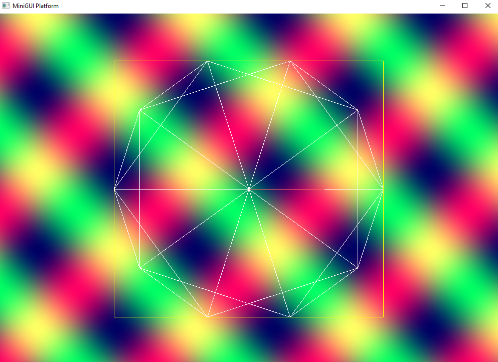
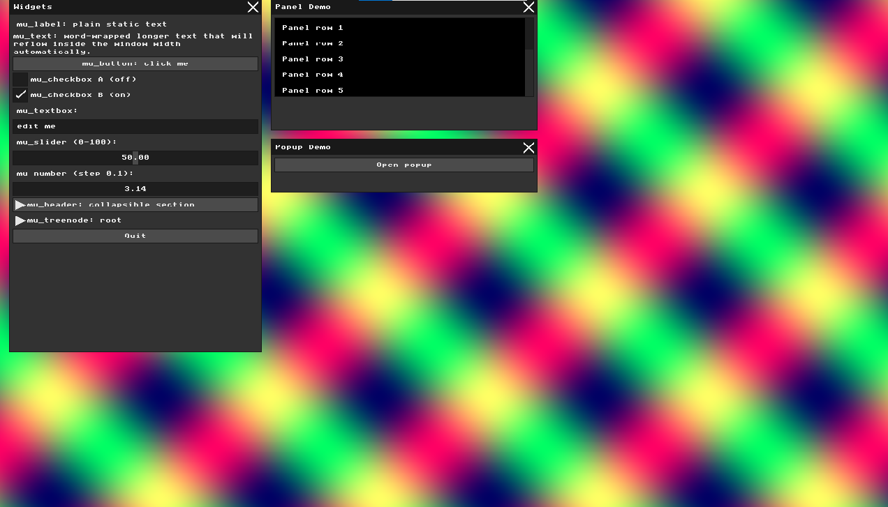
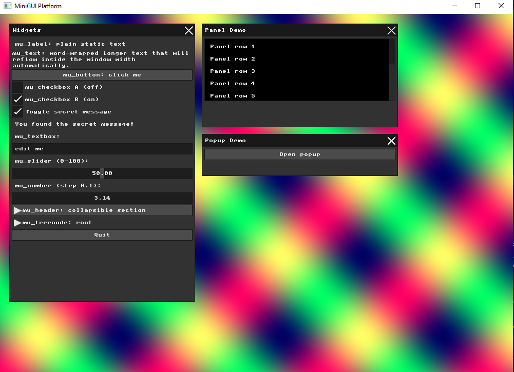
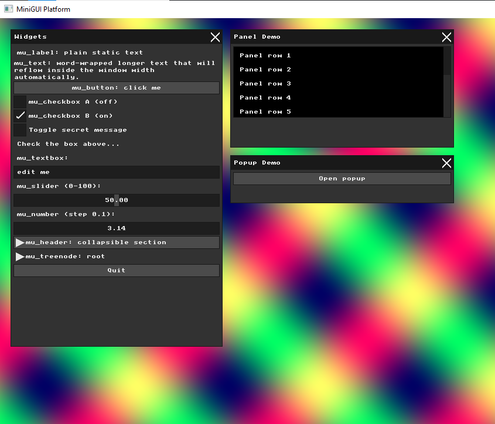
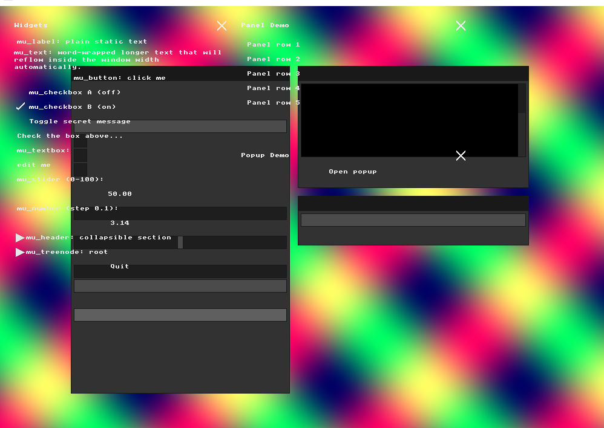
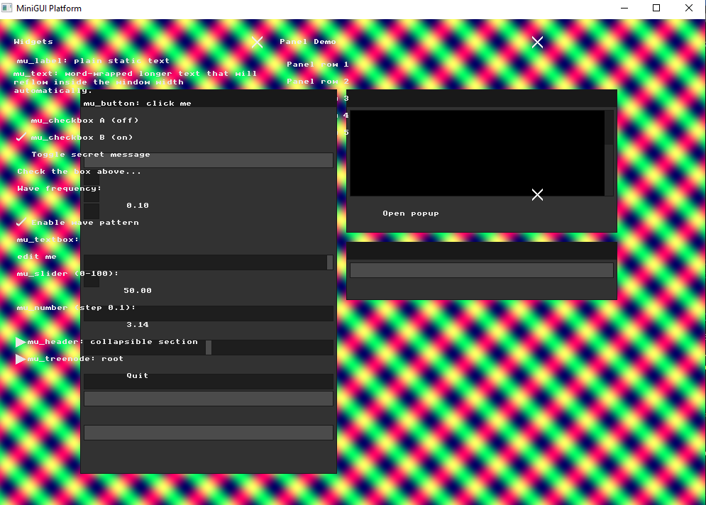
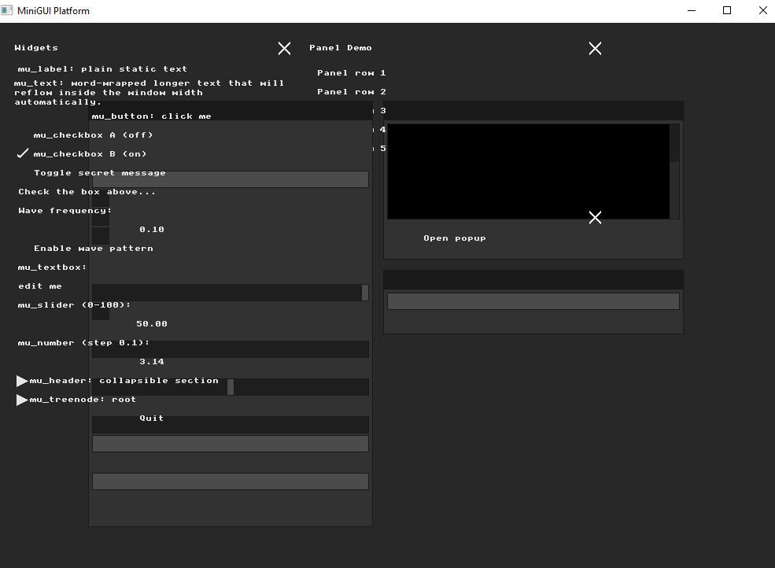

# Assignment: Basic Graphics and Immediate Mode GUI

## Overview

In this assignment, you will explore low-level computer graphics and Immediate Mode Graphical User Interfaces, and draw some lines and curves. You will manipulate a raw framebuffer to render graphics and modify a real-time rendering loop to understand how UI state is calculated and drawn independently of user input.

### Part 1: Manipulating the Framebuffer

##### Background: The Framebuffer and MiniFB
The image you see on your screen is ultimately driven by a **framebuffer**—a dedicated block of memory that holds the color data for every pixel on your display. In our application, we calculate these pixels by writing to `g_buffer`, which is simply a contiguous 1D array of 32-bit integers in memory. 

However, writing to `g_buffer` doesn't automatically draw it to the screen. To do that, we use a lightweight library called **MiniFB** (Mini Framebuffer), which manages the window system and event updates. Every frame, MiniFB takes our completed `g_buffer` array and handles the low-level operating system calls to push our pixel data into the actual hardware framebuffer so it appears on your monitor.

##### Background: 32-bit ARGB Colors
Every 32-bit integer in our `g_buffer` array represents 4 bytes of memory, which define the precise **ARGB** color of exactly one pixel on the screen. 

ARGB stands for **A**lpha, **R**ed, **G**reen, and **B**lue. The **Alpha** channel determines the opacity or transparency of a pixel. In this assignment, we will ignore the alpha channel entirely because we are writing solid colors directly to the screen and do not need to calculate complex transparency blending. 

Instead of writing 32-bit integers manually, we use a macro called `MFB_RGB(r, g, b)`. **It is highly encouraged to look at the implementation of this macro** to see exactly how it shifts and combines separate red, green, and blue values into a single 32-bit integer!

##### Task
Open `main.cpp` and locate the Scene Rendering (Background) loop. Notice the `for` loop iterating over `WIDTH * HEIGHT`. Inside, it calculates the 2D `x` and `y` coordinates based on the 1D index `i`. It then assigns a 32-bit color integer to `g_buffer[i]` using the `MFB_RGB(r, g, b)` macro.

**Write a new mathematical expression for `r`, `g`, and `b` that will draw something different and creative.** Instead of just making a solid color, try generating gradients, shapes, or interesting patterns using the `x`, `y`, and `i` variables. Write a new expression that utilizes both the `x` and `y` coordinates to create a visible 2D pattern (e.g., a gradient, a checkerboard, or concentric circles). For full credit, the pattern cannot be a solid color or a 1D horizontal/vertical strip. Note: You are welcome to use AI to assist you in coming up with the math for these visual patterns!


### Part 2: Immediate Mode UI Declaration

##### Background: The Basics of GUIs and Widgets
A Graphical User Interface (GUI) allows users to interact with a program through visual building blocks. Depending on the software framework you use, these interactive building blocks go by many different names, most commonly **"widgets", "controls", "elements", or "components"**. 

Typical GUI elements include:
*   **Buttons:** Clickable areas that trigger specific actions.
*   **Sliders:** Draggable tracks used to select a numeric value from a specific range.
*   **Labels:** Static text blocks used to display information.
*   **Text Inputs & Checkboxes:** Fields for capturing string input or toggling true/false boolean states.

##### Background: Retained vs. Immediate Mode Architectures
When programming a UI, there are two primary architectural paradigms you will encounter:

1.  **Retained Mode:** UI elements are instantiated as persistent objects in memory, stored by the system, and eventually destroyed when no longer needed. 
2.  **Immediate Mode:** The entire UI is declared from scratch every single frame via sequential function calls. 

In this project, we are using a library called **MicroUI**, which implements an **Immediate Mode** architecture. MicroUI functions as an abstract state machine: it calculates layouts and interaction states, but because the widgets are destroyed and recreated every frame, they cannot store their own internal data. Instead, they read and mutate external variables in your application using memory pointers.

##### Task
In `main.cpp` under the `mu_begin(ctx)` block, add a new interactive widget (such as a button or checkbox) that simply prints a message to the console or toggles a static text label within the MicroUI window. This will allow you to practice Immediate Mode syntax and UI layout without worrying about the broader application state yet.


### Part 3: The Real-Time Graphics Loop and Input Handling

##### Background: The Event Loop and Callbacks
To maintain a smooth framerate and interactive application, the program executes a strict chronological sequence of operations many times per second—commonly referred to as the **event loop**. In our code, this primary loop is controlled by `while (mfb_update_events(window) != MFB_STATE_EXIT)`. 

But how does the operating system interface with input devices (like a keyboard) and pass that data into our loop? It relies on **callbacks**. A callback is a function that you pass to the window manager so the OS knows exactly what code to execute when a hardware interrupt (like a keystroke) occurs. 

For example, in `main.cpp`, we register a function using `mfb_set_char_input_callback`. When a user presses a key, the OS triggers this callback, which calls `ui_bridge_char_input` to save the keystroke into a temporary array called `g_pending_text`. Later, during the sequential event loop, `ui_bridge_input` checks this array and feeds the captured input into the UI system. This separation ensures that unpredictable user inputs are safely synchronized with the strict timing of our rendering loop.

##### Task
In `main.cpp`, locate the character input callback (`mfb_set_char_input_callback`) just above the main event loop. **Be creative and intercept the input pipeline to trigger a custom visual effect:** write custom logic inside the callback so that pressing a specific key on your keyboard dynamically alters an application state variable, instantly changing the background pattern, randomizing the colors, or toggling a visual effect on the screen! 

*Note on event consumption:* If you intercept an event here, you must decide whether to "consume" it (stop the UI from seeing it) or pass it along to the UI bridge (`g_pending_text`) so normal widgets still function correctly.


### Part 4: UI Architecture & The Renderer Bridge

##### Background: Abstract State vs. Visual Rendering
As you have learned, MicroUI generates an abstract list of commands, such as drawing rectangles, text, or icons. However, MicroUI itself has absolutely no concept of pixels or how to draw them to your screen.

To bridge this gap, we use a separate rendering system defined in our `UIRenderer` class. The `UIRenderer::render` function processes the queue of commands generated by MicroUI via a `while (mu_next_command(ctx, &cmd))` loop, translating these instructions into actual pixel manipulations.

This separation of concerns means that the physical boundaries where a button detects a "click" are calculated entirely independently from where the visual representation of that button is drawn to the framebuffer.

##### Task
Open `ui_renderer.cpp` and locate the rendering methods like `draw_rect` or `draw_text`. **Implement a custom visual transformation or stylistic override**—such as shifting coordinates, adding a wave effect, or injecting a color glitch—specifically when calculating the 1D index and assigning pixels to `m_buffer`. Recompile and attempt to interact with your transformed UI elements on the screen. 

After applying your visual offset, attempt to click on a button. In your code comments or submission text, explain exactly *why* clicking the visual representation of your shifted button no longer works, and describe where you must put your mouse cursor to successfully trigger it.

---

### Part 5: Binding UI to Application State

##### Background: Memory Pointers and State Mutation
Because Immediate Mode widgets are destroyed and recreated from scratch every single frame, they are fundamentally "stateless"—meaning they cannot store their own internal memory.

To function interactively, widgets instead take pointers to external variables that live in your application logic. When you drag a slider, the widget doesn't update its own internal "slider value"; rather, it directly mutates the value at the specific memory address you provided using the C++ address-of operator (`&`).

##### Task
In `main.cpp`, observe how the variable `slider_val` is passed into the slider widget using `mu_slider(ctx, &slider_val, 0, 100);`. **Design a new interactive feature** by declaring your own custom application state variables and binding them to brand new widgets (like sliders or checkboxes) inside the `mu_begin_window` block. Connect these newly bound variables to your background rendering loop from Part 1 so that interacting with your UI dynamically morphs, recolors, or animates the creative visual pattern you generated.

### Part 6: Interactive Line Drawing App

##### Background: Implementing the Algorithm
In class, we discussed the theory behind **Bresenham's Line Algorithm** and how it elegantly approximates a straight line on a discrete pixel grid using only fast integer math. Now, it is time to translate that theory into a working renderer.

As you recall, calculating lines that go in any arbitrary direction means handling all eight possible octants (e.g., steep slopes vs. shallow slopes, drawing left-to-right vs. right-to-left). This can quickly lead to a messy explosion of `if-else` statements and redundant code. Your code should adhere to the *DRY* principle.

##### Task: Write the Line Function
Write a new function, such as `draw_line(int x0, int y0, int x1, int y1, uint32_t color)`, that calculates the pixels of a line between `(x0, y0)` and `(x1, y1)` using your optimized Bresenham's implementation. For each calculated pixel, assign the `color` to the correct 1D index in your `g_buffer`. Test it by hardcoding a few lines into your background render loop to verify the math is working across different slopes and directions.

##### Task: AI-Assisted UX Planning
Now, you must bridge the Immediate Mode UI concepts from Parts 2-5 with your new `draw_line` function to create an interactive drawing tool. But before you write the code, you need to design the interaction. 

**Use an AI assistant to brainstorm the User Experience (UX) for drawing.** Prompt the AI to discuss the pros, cons, and logic of different ways a user might draw a line with a mouse. 
*   Does the user click once to set the start point, and click again to set the end point? 
*   Do they click and hold, drag the mouse, and release to finalize the line? 
*   If they drag, how do you manage the "state" so the line is previewed but not permanently drawn until the mouse is released?

Reason through these approaches, choose the one you think makes the best application, and implement it using MicroUI's input and mouse state variables.

##### Task: The Creative Canvas
Combine everything you have built into a useful, interactive tool. The baseline requirement is that the user can interactively draw multiple permanent lines onto the screen. 

However, you are highly encouraged to push the limits of your architecture. An ambitious implementation might feature:
*   A UI panel with sliders to control the RGB values of the current line.
*   A "Clear Screen" button.
*   An automated "spirograph" mode that draws algorithmic lines based on UI slider parameters.
*   Logic to handle drawing continuous, connected lines (a brush tool).

Design an interface and visual result that you are proud of!

### Part 7: Pair Programming Extensions

*Students working in pairs are required to complete the following three extensions to receive full credit.*

##### 1. Bresenham's Circle Algorithm
*   **Background:** The principles of Bresenham's line algorithm can be extended to draw circles by exploiting 8-way symmetry—you only need to calculate the math for one octant and mirror the pixels to the other seven.
*   **Task:** Implement a `draw_circle(int xc, int yc, int r, uint32_t color)` function. Update your AI-assisted UI from Part 6 to support a "Circle Mode," allowing the user to click and drag to dynamically define the center and radius of a circle. 

##### 2. Performance Profiling: Bresenham vs. Naive
*   **Background:** Bresenham's algorithm was designed to avoid expensive floating-point arithmetic. However, modern CPUs process floating-point math significantly faster than hardware from the 1960s. Is the strict integer optimization still noticeably faster today?
*   **Task:** Implement a "naive" line drawing function that uses standard `float` math (calculating the slope $m$ and evaluating $y = mx + b$). Write a benchmarking routine that draws 100,000 random lines using both algorithms. Log the execution times to the console to definitively compare their performance on your specific hardware.

##### 3. Anti-Aliasing: Xiaolin Wu's Algorithm
*   **Background:** Bresenham's algorithm produces "aliased" (jagged) lines. Xiaolin Wu's line algorithm solves this by drawing pairs of pixels that straddle the mathematical line, distributing the color intensity based on the exact fractional distance to the line's true center. 
*   **Task:** Implement Xiaolin Wu's line algorithm. Because our assignment ignores the alpha channel (as established in Part 1). Note what happens when you draw a line on top of another line and attempt to fix the issue. Finally, add a UI toggle to instantly switch between Bresenham and Xiaolin Wu modes to visually compare the results.

# Submission Report

## Part 1: Manipulating the Framebuffer

### Approach
I modified the background rendering loop in `main.cpp` to generate a **diagonal wave interference pattern** instead of the original linear gradient. The original code used `x` for red and `y` for green independently — producing a simple two-axis gradient with no real 2D interaction between the axes.

My implementation combines `x` and `y` together using `sinf()`:

```cpp
uint8_t r = (uint8_t)(128 + 127 * sinf((x + y) * wave_freq + g_color_phase));
uint8_t g = (uint8_t)(128 + 127 * sinf((x - y) * wave_freq + g_color_phase));
uint8_t b = 100;
```

- The **red channel** oscillates along `x + y` — diagonal bands going top-left to bottom-right.
- The **green channel** oscillates along `x - y` — diagonal bands going the opposite direction.
- Since `sinf()` outputs values between -1 and 1, I scaled by 127 and shifted by 128 to keep all values in the valid 0–255 byte range.
- The two crossing diagonal wave patterns interfere with each other, creating a crosshatch-style color shimmer across the screen.

### Result


---

## Part 2: Immediate Mode UI Declaration

### Approach
I added a new checkbox widget bound to a `static int show_secret` variable. Below it, a label is recalculated every frame based on the checkbox's current value:

```cpp
mu_checkbox(ctx, "Toggle secret message", &show_secret);
if (show_secret) {
  mu_label(ctx, "You found the secret message!");
} else {
  mu_label(ctx, "Check the box above...");
}
```

### Immediate Mode Demonstration
This illustrates the core Immediate Mode principle: the checkbox has no internal memory of its own. Each frame, `mu_checkbox` directly mutates `show_secret` through the pointer passed to it, and the label content is freshly decided by the `if` statement every single frame. There is no persistent "Label object" being updated — the entire UI tree is rebuilt from scratch each frame.

### Result


---

## Part 3: The Real-Time Graphics Loop and Input Handling

### Approach
I added a global state variable `g_color_phase` and modified the character input callback so that pressing `c` shifts the color phase of the background wave pattern:

```cpp
mfb_set_char_input_callback(
  [](struct mfb_window *w, unsigned int c) {
    if (c == 'c') {
      g_color_phase += 2.0f;
      return; // consume the event
    }
    extern void ui_bridge_char_input(struct mfb_window *, unsigned int);
    ui_bridge_char_input(w, c);
  },
  window);
```

`g_color_phase` is added into the `sinf()` calculations in the background loop, so each press of `c` visibly shifts the wave pattern's colors.

### Event Consumption
Note the `return;` after handling `'c'`. This **consumes** the event — the keystroke never reaches `ui_bridge_char_input`, so it won't be typed into any focused textbox. Had I omitted the `return`, the character `'c'` would fall through to the UI bridge and be typed into any focused textbox. I chose to consume it here because `c` is meant as a global application shortcut, not a printable character.

### Result


---

## Part 4: UI Architecture and the Renderer Bridge

### Approach
In `ui_renderer.cpp`, I modified `draw_rect` to apply a visual pixel offset when writing to `m_buffer`, without changing the logical rect coordinates used for layout and hit-testing:

```cpp
int shift_x = 100;
int shift_y = 80;

for (int y = y1; y < y2; y++) {
    for (int x = x1; x < x2; x++) {
        int dx = x + shift_x;
        int dy = y + shift_y;
        if (dx >= 0 && dx < m_width && dy >= 0 && dy < m_height) {
            m_buffer[dy * m_width + dx] = c;
        }
    }
}
```

This change was reverted after the experiment so the UI remained usable for the rest of the assignment.

### Result and Explanation
After applying the offset, all button/window background rectangles visually shifted 100px right and 80px down. However, `draw_text` was left unmodified, so text labels remained at their original positions.

**Key finding:** Clicking directly on the visible "Quit" text successfully triggered the quit action, while clicking on the visibly shifted gray rectangle background did nothing.

This happens because MicroUI's input hit-testing always operates on the *original* rect coordinates passed into the immediate-mode calls — it has no awareness of where pixels were ultimately drawn to the framebuffer. The `UIRenderer` is solely responsible for translating logical rects into pixels; shifting that translation does not affect MicroUI's internal layout or click-detection math at all.

### Result


---

## Part 5: Binding UI to Application State

### Approach
I declared two new global state variables alongside `g_color_phase`:

```cpp
static float wave_freq = 0.02f;
static int waves_enabled = 1;
```

These are bound to two new widgets inside the "Widgets" window:

```cpp
mu_label(ctx, "Wave frequency:");
mu_slider(ctx, &wave_freq, 0.001f, 0.1f);
mu_checkbox(ctx, "Enable wave pattern", &waves_enabled);
```

The background rendering loop from Part 1 reads these variables every frame:

```cpp
if (waves_enabled) {
  r = (uint8_t)(128 + 127 * sinf((x + y) * wave_freq + g_color_phase));
  g = (uint8_t)(128 + 127 * sinf((x - y) * wave_freq + g_color_phase));
  b = 100;
} else {
  r = g = b = 40; // flat dark gray when disabled
}
```

### Result
Dragging the slider live-adjusts the wave band spacing by changing `wave_freq` directly through the pointer `&wave_freq` every frame. Unchecking "Enable wave pattern" immediately switches the background to flat dark gray — demonstrating how the same Immediate Mode binding pattern from Part 2 extends naturally to drive procedural rendering.



---

## Part 6: Interactive Line Drawing App

### Bresenham's Line Algorithm
I implemented `draw_line` using the unified single-loop variant of Bresenham's algorithm, which avoids branching into separate code paths for each of the 8 octants:

```cpp
void draw_line(int x0, int y0, int x1, int y1, uint32_t color) {
  int dx = abs(x1 - x0);
  int dy = -abs(y1 - y0);
  int sx = (x0 < x1) ? 1 : -1;
  int sy = (y0 < y1) ? 1 : -1;
  int err = dx + dy;
  int x = x0, y = y0;
  while (true) {
    if (x >= 0 && x < WIDTH && y >= 0 && y < HEIGHT)
      g_buffer[y * WIDTH + x] = color;
    if (x == x1 && y == y1) break;
    int e2 = 2 * err;
    if (e2 >= dy) { err += dy; x += sx; }
    if (e2 <= dx) { err += dx; y += sy; }
  }
}
```

`sx`/`sy` encode direction as +1/-1 instead of branching per direction, and the single `err` accumulator handles both steep and shallow slopes within the same loop body — satisfying the DRY requirement.

### AI-Assisted UX Planning
Before implementing interactive drawing, I used AI assistance to reason through three possible UX approaches:

1. **Click-click (two separate clicks):** Simple to implement but no live preview and risks accidental line creation.
2. **Click-drag-release:** Matches the standard mental model of most drawing tools (Paint, Figma, etc.), naturally supports a live preview while dragging, and only requires three pieces of state.
3. **Continuous/brush mode:** Good for freeform sketching but overkill for clean geometric lines.

I chose **click-drag-release** for the best balance of intuitive UX and simple state management, with a live preview so the user can see exactly where the line will land before committing.

### The Creative Canvas
I implemented permanent line storage and click-drag-release interaction. A drag begins only when the mouse is pressed outside any MicroUI widget (`ctx->hover == 0`), preventing accidental line creation while interacting with UI panels. While dragging, a live preview line is drawn each frame; on release the line is committed permanently.

**Extensions added:**
- **RGB sliders** controlling the color of the next line drawn (and the live preview)
- **A "Clear Screen" button** resetting `g_line_count` to 0

### Result

