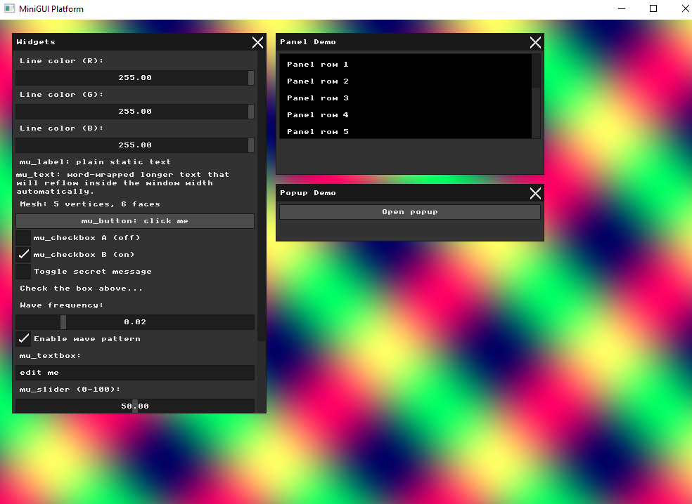
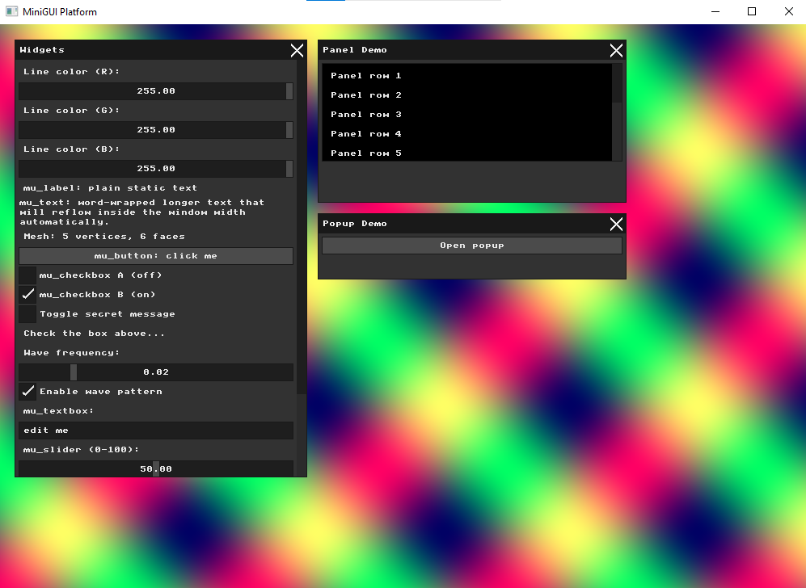
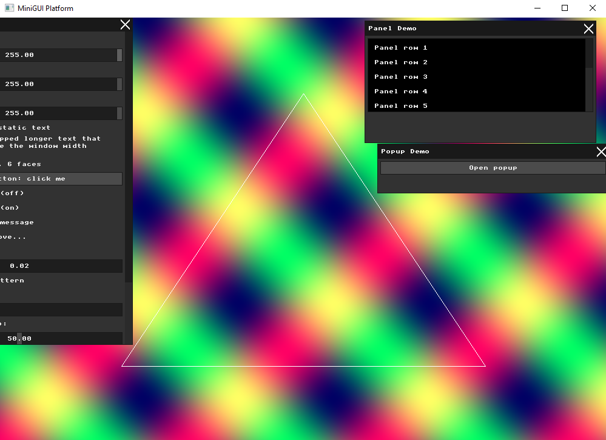
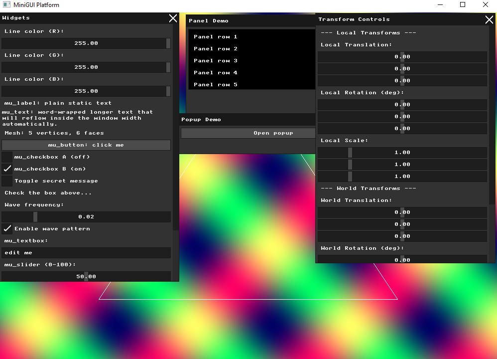
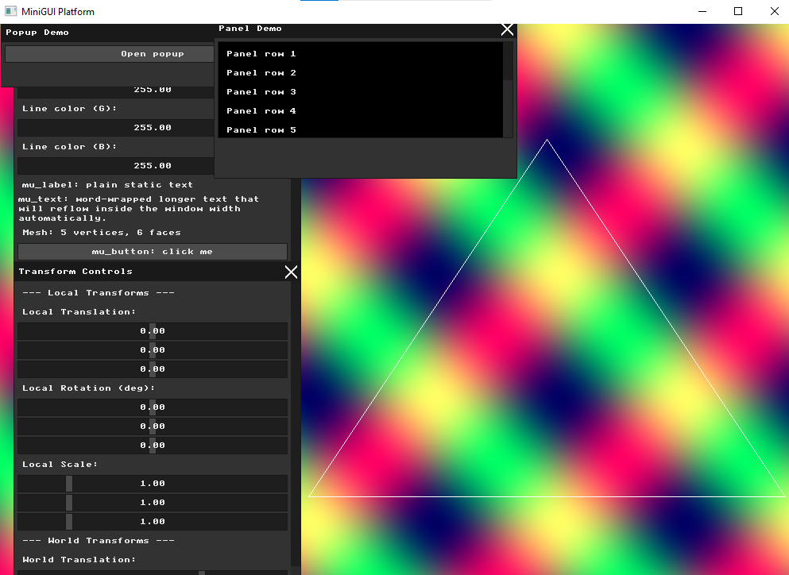

# Assignment: Wireframe Viewer and Geometric Transformations

## Overview

In this assignment, you will transition from drawing 2D pixels to manipulating 3D geometry. You will load a 3D mesh into memory, project its vertices onto your 2D screen, and draw it using the line-drawing algorithm you built in Assignment 1. Finally, you will implement mathematical transformations (scaling, rotation, and translation) and wire them up to your Immediate Mode GUI to manipulate the 3D object in real-time.

### Part 0: Introduction to GLM

In computer graphics, manipulating 3D objects requires a lot of linear algebra, specifically vectors and matrices. Writing your own math library from scratch can be tedious and prone to errors. Instead, the industry standard for OpenGL and similar graphics applications is **GLM** (OpenGL Mathematics). GLM is a header-only C++ mathematics library based on the OpenGL Shading Language (GLSL) specifications, making it incredibly useful for transformations and vector math.

##### Task

Before proceeding to 3D transformations, you need to integrate GLM into your project. Ask an AI assistant to help you set this up. We recommend using a prompt similar to this:
*"Update cmake to fetch GLM and include it in the code, and add a small example in main that demonstrates how it works."*

Verify that the project successfully configures, compiles, and the small GLM example runs without errors.

### Part 1: Loading and Inspecting 3D Data

In computer graphics, 3D objects are typically represented as a **polygon mesh**. A mesh consists of two primary lists of data:

1. **Vertices:** A list of 3D points $(x, y, z)$ in space.

2. **Faces (or Polygons):** A list of indices that connect the vertices together. In our case, every face is a triangle connecting exactly three vertices.

Before we can draw anything, we must parse a 3D model file from the hard drive and store its vertices and faces in memory (usually in structures like `std::vector<Vector3>` and `std::vector<Face>`).

##### Task

Write a function that loads an `.obj` file. To check your code, create an `.obj` file that contains an object with up to 10 vertices and faces, load it, and display the number of faces and vertices in the GUI and see if it matches the content of the file. You may display more information as seem necessary.

### Part 2: Normalization and the Viewport Transform

When you load a mesh, its vertex coordinates are completely arbitrary. A model of an ant might have coordinates ranging from $-0.01$ to $0.01$, while a model of a city block might range from $-5000$ to $5000$, but it could also be the opposite. There are no guarantees.

If you try to draw these raw coordinates directly to your framebuffer (which likely ranges from $0$ to $1000$ pixels), the whole object might be contained in a single pixel, or be entirely off-screen. To fix this, we must apply a *temporary* debugging transformation to scale and center the object so it fits nicely inside our window.

##### Task

Write an algorithm to find the bounding box of your loaded mesh (the minimum and maximum $x$, $y$, and $z$ values). Using this information, calculate a uniform scale factor and a translation vector to map the model's vertices so that they fit comfortably within your window's dimensions (e.g., scaling them up/down to around $0-1000$ and centering them). In your report, write a brief explanation of the mathematical logic you used to calculate this specific bounding-box-to-window transformation.

### Part 3: Orthographic Projection and Wireframe Rendering

Our screen is a 2D grid of pixels, but our mesh exists in 3D space. To draw it, we must mathematically flatten the 3D vertices into 2D points.

The simplest way to do this is an **Orthographic Projection**, which essentially ignores depth. To orthographically project a point $(x, y, z)$ straight onto the 2D plane of your monitor, you simply drop the $z$-coordinate and use $(x, y)$ to draw to the screen.

##### Task

Iterate over all the faces (triangles) in the mesh. For each triangle, retrieve its three 3D vertices, drop one of the coordinates (typically $z$) to project them into 2D, and draw the three connecting edges using the `draw_line` function you wrote in Assignment 1. You should now see a static wireframe model clearly displayed on your screen! Place a screenshot of your rendered wireframe model in your report.

### Part 4: Transformation Matrices & Immediate Mode GUI

To move, rotate, or scale a 3D object, we multiply its vertices by $4 \times 4$ transformation matrices. A complex movement is achieved by creating separate basic matrices for Scale ($S$), Rotation ($R$), and Translation ($T$), and multiplying them together into a single Model Matrix ($M$).

Furthermore, transformations can occur in different "frames of reference." You can transform an object relative to its own center (**Local Transformations**) or relative to the center of the universe (**World Transformations**).

##### Task

In your rendering loop, add new GUI widgets (such as sliders or input boxes) to control the $X, Y, Z$ parameters for both Local and World transformations. You should have separate UI controls for:

* Local Translation, Local Rotation, Local Scale

* World Translation, World Rotation, World Scale

Take a screenshot of the GUI layout you designed and include it in your report.

### Part 5: Applying Transformations

In linear algebra, matrix multiplication is not commutative ($A \cdot B \neq B \cdot A$). The order in which you apply transformations drastically changes the visual result.

If you *Translate then Rotate*, the object moves to a new position and then revolves around the origin like a planet orbiting the sun. If you *Rotate then Translate*, the object spins in place like a top, and is then moved to its new position. This distinction is the core difference between World and Local frame transformations.

##### Task

Compute the final transformation matrices based on your UI slider values, and apply them (by multiplying) to your mesh's vertices *before* you perform the orthographic projection and draw the lines. Verify that the model transforms interactively as you move the sliders. Show two screenshots in your report comparing the difference between:

1. Translating in the model (local) frame and then rotating in the world frame.

2. Translating in the world frame and then rotating in the local (model) frame.

### Part 6: Interactive Input Modifiers

While GUI sliders are excellent for precise control, modern 3D applications allow users to interact with the scene directly using the mouse or keyboard. By intercepting input events before they reach the UI, we can increment or decrement our transformation state variables dynamically.

##### Task

Implement one approach for modifying the basic transformations using direct keyboard or mouse input. For example, you might map the arrow keys to World Translation, or map holding the left mouse button and dragging to Local Rotation. Describe your chosen input method and how it modifies the transformation state in your report.

### Part 7: Pair Programming Extensions

*Students working in pairs are required to complete the following extensions.*

##### 1. Multiple Model Management (Scene Graph Basics)

A real scene contains more than one object. To manage this, an application needs a way to store multiple meshes and maintain independent transformation states (position, rotation, scale) for each one.

* **Task:** Allow loading and storing multiple different `.obj` models simultaneously. Add a UI element (like a dropdown or a list of radio buttons) to select the "Active Model." Ensure that your Transformation GUI and keyboard/mouse inputs only affect the currently active model, allowing you to compose a scene with multiple objects placed independently. Demonstrate the result of placing multiple independent models in a single screenshot in your report.

##### 2. Advanced Mouse Control

Object manipulation usually requires combining multiple mouse inputs to handle different types of transformations intuitively.

* **Task:** Implement a *second* approach for modifying transformations using the mouse (so you have two total, fulfilling the "two approaches" requirement for pairs). For example, if you mapped mouse-dragging to rotation in Part 6, map the mouse scroll wheel to uniformly scale the active object, or map right-click-dragging to translation. Describe both implementations in your report.

# Submission Report

## Part 0: Introduction to GLM

### Approach
I integrated GLM into the project using CMake's `FetchContent`, following the same pattern already used for MiniFB and microui:

```cmake
FetchContent_Declare(
    glm
    GIT_REPOSITORY https://github.com/g-truc/glm.git
    GIT_TAG        1.0.1
    GIT_SHALLOW    TRUE
)
FetchContent_MakeAvailable(glm)
```

And linked it via:
```cmake
target_link_libraries(minigui PRIVATE microui_lib minifb glm::glm)
```

### Verification
I added a small test in `main()` that translates a `glm::vec3` by a `glm::mat4` translation matrix and prints the result to the console:

```cpp
glm::vec3 test_vec(1.0f, 2.0f, 3.0f);
glm::mat4 test_mat = glm::translate(glm::mat4(1.0f), glm::vec3(5.0f, 0.0f, 0.0f));
glm::vec4 result = test_mat * glm::vec4(test_vec, 1.0f);
printf("GLM test: translated vec3(1,2,3) by (5,0,0) -> (%.1f, %.1f, %.1f)\n",
       result.x, result.y, result.z);
```

The output correctly confirmed `(1,2,3)` translated by `(5,0,0)` yields `(6,2,3)`, verifying GLM was correctly fetched, linked, and functional.

---

## Part 1: Loading and Inspecting 3D Data

### Approach
I wrote a simple `.obj` parser that reads `v` (vertex) and `f` (face) lines from a plain text file:

```cpp
struct Vertex { float x, y, z; };
struct Face { int v0, v1, v2; };

std::vector<Vertex> g_mesh_vertices;
std::vector<Face> g_mesh_faces;

bool load_obj(const std::string& path) {
  std::ifstream file(path);
  std::string line;
  while (std::getline(file, line)) {
    std::istringstream ss(line);
    std::string prefix;
    ss >> prefix;
    if (prefix == "v") {
      Vertex v;
      ss >> v.x >> v.y >> v.z;
      g_mesh_vertices.push_back(v);
    } else if (prefix == "f") {
      int i0, i1, i2;
      ss >> i0 >> i1 >> i2;
      g_mesh_faces.push_back({i0 - 1, i1 - 1, i2 - 1}); // OBJ is 1-indexed
    }
  }
}
```

A key detail is that OBJ face indices are **1-based**, so I subtract 1 when storing them to match C++'s 0-based vector indexing.

### Verification
I created a test file `pyramid.obj` containing a square-base pyramid (5 vertices, 6 triangular faces). After loading, I displayed the parsed counts directly in the GUI using `mu_label`. The displayed count matched the file's actual content exactly, confirming the parser works correctly.

### Result


---

## Part 2: Normalization and the Viewport Transform

### Mathematical Logic
To map any mesh's arbitrary coordinate range to fit comfortably on screen:

1. **Bounding box:** iterate all vertices to find `min` and `max` in X, Y, Z.
2. **Uniform scale:** divide the target screen size by the largest extent across all axes — this ensures the biggest dimension fills the target while preserving proportions.
3. **Center translation:** compute the mesh's center as `(min + max) / 2`, then translate by `-center * scale` to move the scaled mesh's center to the origin. In the projection step, the screen center offset (`WIDTH/2`, `HEIGHT/2`) is added to place it at the middle of the window.

For the pyramid (largest extent = 2.0 units):
```
scale = 600 / 2.0 = 300
```

### Console Output
```
Normalize: scale=300.0000, translate=(-0.00, -225.00, -0.00)
```

This correctly centers the pyramid and scales it to fit within the target area.

### Result


---

## Part 3: Orthographic Projection and Wireframe Rendering

### Approach
For each face (triangle) in the mesh, I retrieved its three vertices, applied the normalization transform, then dropped the Z coordinate (orthographic projection) to get 2D screen coordinates:

```cpp
Point2D project_vertex(const Vertex& v, const Transform& t) {
  float wx = v.x * t.scale + t.translate.x;
  float wy = v.y * t.scale + t.translate.y;
  int sx = (int)(wx + WIDTH / 2.0f);
  int sy = (int)(-wy + HEIGHT / 2.0f); // Y flip: screen Y grows downward
  return {sx, sy};
}
```

The Y axis is flipped (`-wy`) because in mathematics Y grows upward, while on screen Y grows downward — without this flip the pyramid appears upside down.

Each triangle's three edges are then drawn using the `draw_line` function from HW1.

### Result


---

## Part 4: Transformation Matrices and Immediate Mode GUI

### Approach
I added a new **"Transform Controls"** window separate from the existing "Widgets" window, containing sliders for all 6 transformation groups (Local and World, each with Translation, Rotation, and Scale for X, Y, Z):

```cpp
if (mu_begin_window(ctx, "Transform Controls", mu_rect(20, 300, 360, 500))) {
  mu_label(ctx, "--- Local Transforms ---");
  mu_label(ctx, "Local Translation:");
  mu_slider(ctx, &local_translation.x, -500.0f, 500.0f);
  mu_slider(ctx, &local_translation.y, -500.0f, 500.0f);
  mu_slider(ctx, &local_translation.z, -500.0f, 500.0f);
  // ... rotation and scale sliders ...
  mu_label(ctx, "--- World Transforms ---");
  // ... world sliders ...
  mu_end_window(ctx);
}
```

At this stage the sliders exist and update variables, but are not yet wired to the mesh rendering (that comes in Part 5).

### Result


---

## Part 5: Applying Transformation Matrices

### Approach
I used GLM to build transformation matrices from the slider values and apply them to each vertex before projecting. The matrix build order follows standard TRS convention:

```cpp
glm::mat4 build_transform(glm::vec3 translation, glm::vec3 rotation_deg, glm::vec3 scale) {
  glm::mat4 T = glm::translate(glm::mat4(1.0f), translation);
  glm::mat4 Rx = glm::rotate(glm::mat4(1.0f), glm::radians(rotation_deg.x), glm::vec3(1,0,0));
  glm::mat4 Ry = glm::rotate(glm::mat4(1.0f), glm::radians(rotation_deg.y), glm::vec3(0,1,0));
  glm::mat4 Rz = glm::rotate(glm::mat4(1.0f), glm::radians(rotation_deg.z), glm::vec3(0,0,1));
  glm::mat4 S = glm::scale(glm::mat4(1.0f), scale);
  return T * Rz * Ry * Rx * S;
}
```

The final matrix combines both local and world transforms:
```cpp
glm::mat4 M_local = build_transform(local_translation, local_rotation, local_scale);
glm::mat4 M_world = build_transform(world_translation, world_rotation, world_scale);
glm::mat4 M_final = M_world * M_local;
```

### Local vs World Transform Demonstration
- **Local translate then World rotate:** the mesh moves away from the origin in local space, then orbits around the world origin when world rotation is applied.
- **World translate then Local rotate:** the mesh spins in place at its new world position when local rotation is applied.

This demonstrates the key difference: local transforms happen relative to the object's own coordinate frame, while world transforms happen relative to the global origin.

---

## Part 6: Interactive Input Modifiers

### Approach
I added a keyboard callback using `mfb_set_keyboard_callback` to intercept arrow key presses and directly modify the `world_translation` variable:

```cpp
mfb_set_keyboard_callback(
    [](struct mfb_window *w, mfb_key key, mfb_key_mod mod, bool isPressed) {
        if (!isPressed) return;
        float step = 10.0f;
        if (key == MFB_KB_KEY_RIGHT) world_translation.x += step;
        if (key == MFB_KB_KEY_LEFT)  world_translation.x -= step;
        if (key == MFB_KB_KEY_UP)    world_translation.y += step;
        if (key == MFB_KB_KEY_DOWN)  world_translation.y -= step;
    },
    window);
```

Arrow keys move the mesh 10 units per keypress. The World Translation sliders in the UI also update in real time to reflect the keyboard-driven changes, since they are bound to the same `world_translation` variable.

### Result

