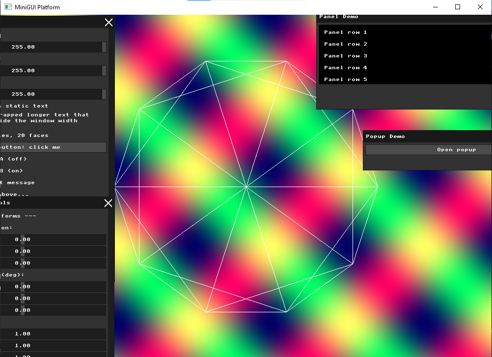
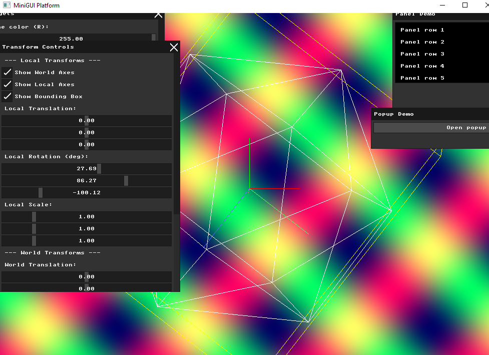
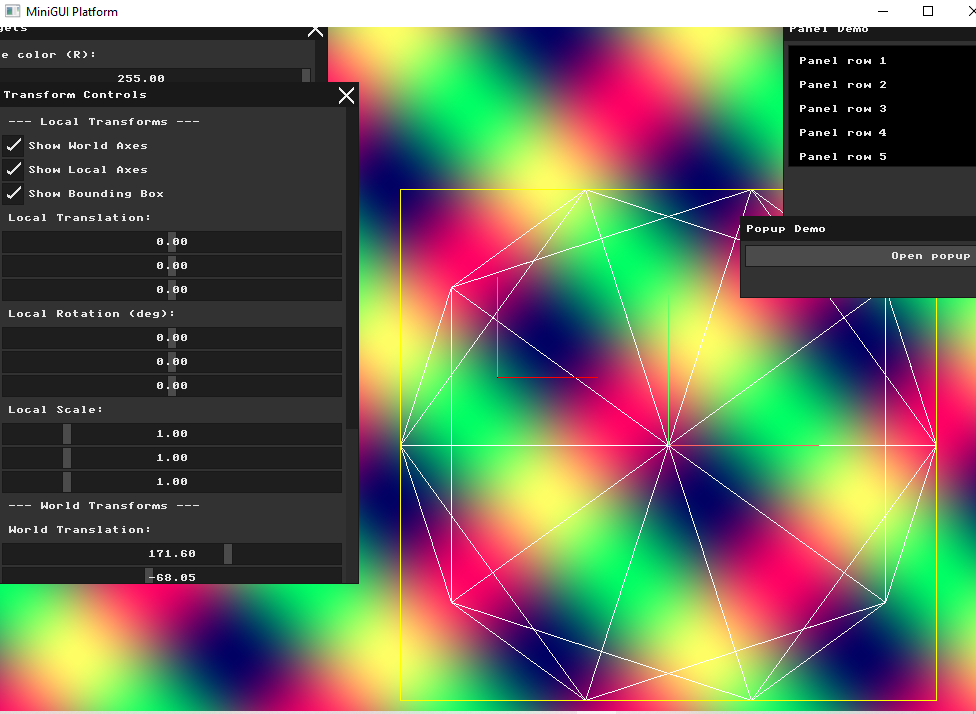
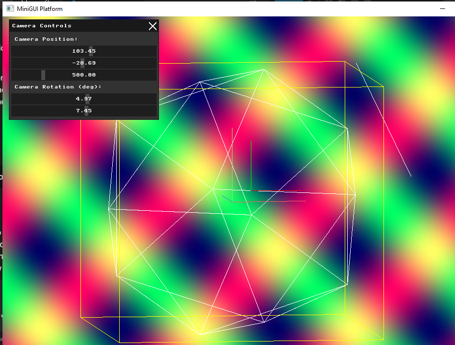
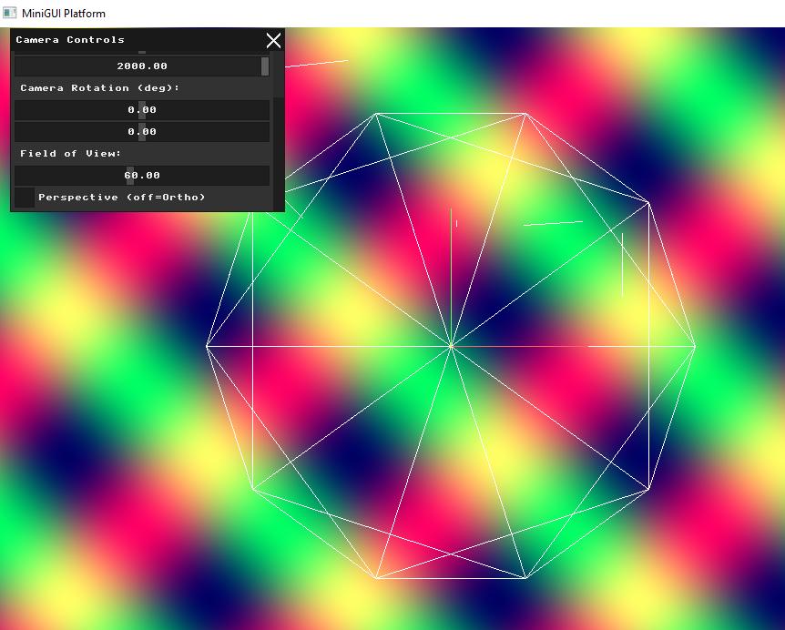
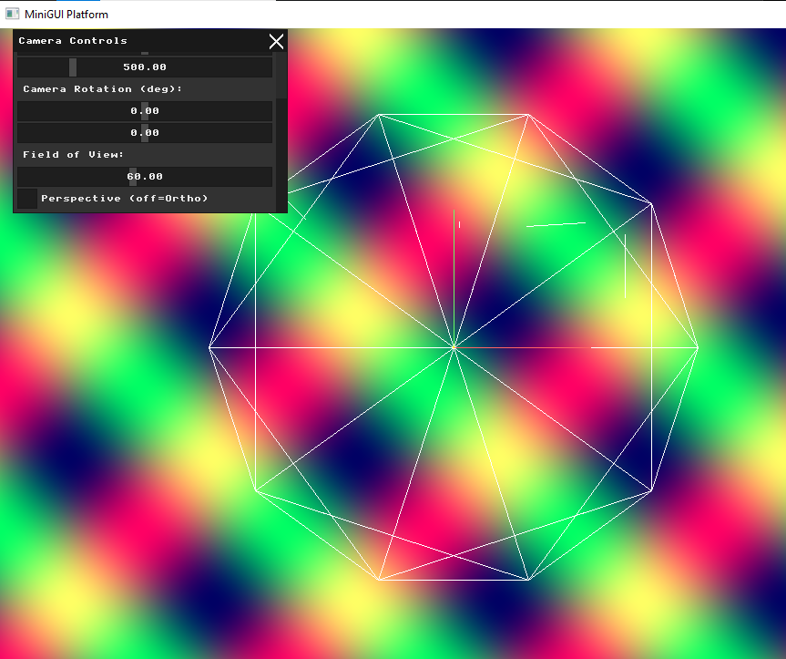
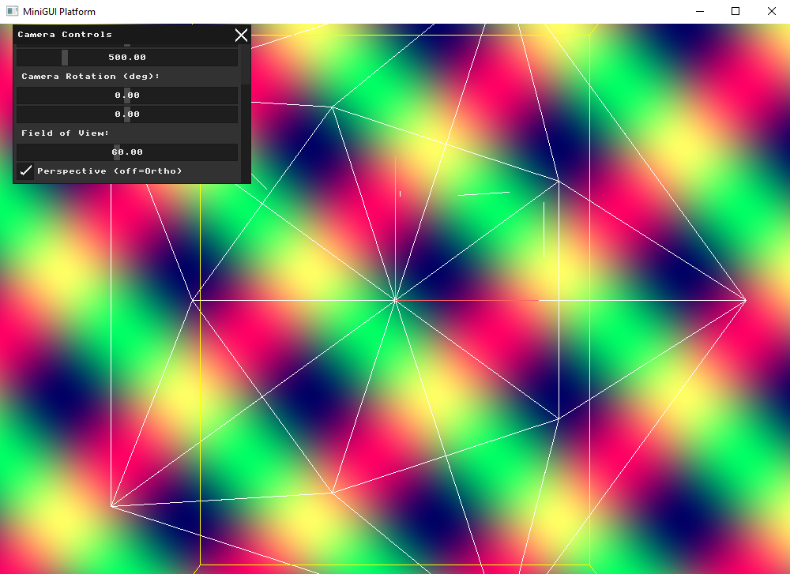
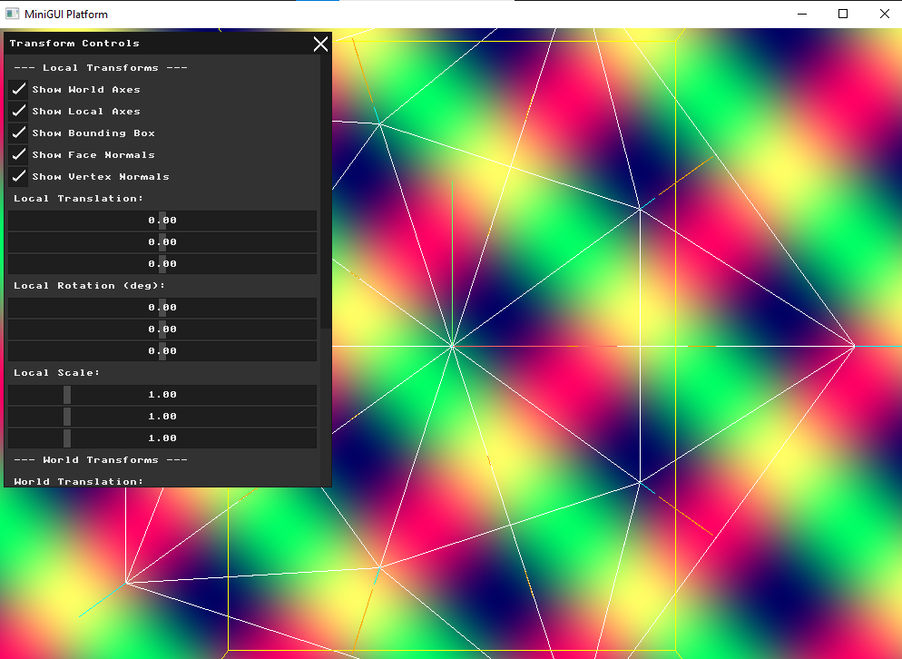
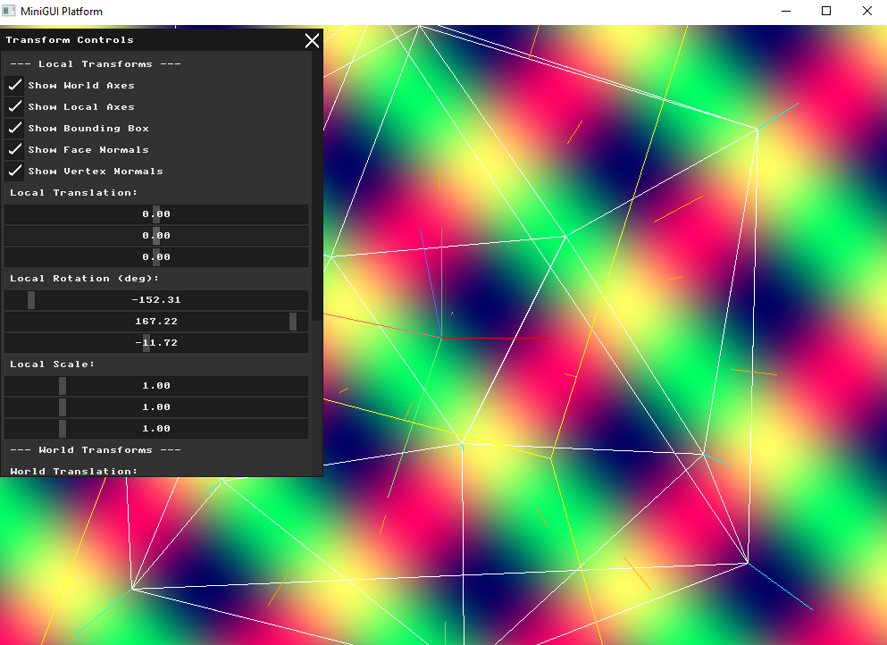

# Assignment: Virtual Cameras and Projections

## Overview

In Assignment 2, you successfully loaded a 3D model, applied mathematical transformations, and orthographically flattened it to the screen. In this assignment, we will implement a proper virtual camera system. You will explore the View matrix, replace your basic orthographic projection with a true Perspective projection, and calculate geometric normals to prepare our models for lighting.

### Part 1: Coordinate Frames and Bounding Boxes

##### Background: Visualizing Space

When manipulating 3D objects, it is incredibly easy to lose track of where the object actually is versus where its local center is. When you translate an object in the "world" frame, its local axes move with it. When you rotate it in the "local" frame, its axes spin. To debug complex transformations, graphics programmers draw helper geometry (like bounding boxes and coordinate axes) to visualize these invisible mathematical spaces.

##### Task

Implement two visual debugging features in your renderer, and add UI checkboxes to toggle them on and off:

1. **Coordinate Axes:** Draw short, colored lines (e.g., Red for X, Green for Y, Blue for Z) originating from the center of the model to represent its Local axes, and a fixed set of axes at `(0,0,0)` to represent the World axes.

2. **Bounding Box:** Calculate the 8 corners of the object's 3D bounding box. Draw the wireframe of this box.
   *Test your implementation:* Transform your model. If you transform in the model frame, the model's axes should remain fixed relative to the model. If you transform in the world frame, the model's axes should transform alongside it!

### Part 2: The Virtual Camera (View Matrix)

##### Background: The Camera Illusion

In computer graphics, a "camera" doesn't actually exist. To create the illusion of a camera moving forward into a scene, we actually move the entire 3D universe backward. This inverse transformation is called the **View Matrix**.

If a camera is positioned at $(C_x, C_y, C_z)$ and rotated by some angle, the View matrix applies the exact *opposite* translation and rotation to every vertex in the scene, effectively bringing the entire world into the camera's local coordinate space.

##### Task

Create a `Camera` object or struct. Give it position and rotation properties. Add UI sliders to control the camera's position and rotation in the world.
Construct the View matrix from these parameters (remembering to invert the transformation!) and multiply your model's vertices by this View matrix *after* the Model matrix but *before* the Projection matrix ($P \cdot V \cdot M \cdot v$). Verify that moving the camera left shifts the object to the right on your screen.

### Part 3: Perspective Projection

##### Background: The View Frustum and Perspective Divide

Orthographic projection (dropping the Z coordinate) makes architectural drafting easy, but it lacks depth—objects far away look the same size as objects close up.

A **Perspective Projection** maps a 3D truncated pyramid (the *frustum*) into a standardized 3D cube (Normalized Device Coordinates). It achieves the illusion of depth through the **Perspective Divide**: dividing the $X$ and $Y$ coordinates by the vertex's distance from the camera ($Z$ or $W$ in homogeneous coordinates). The further away a vertex is, the more its $X$ and $Y$ values are squashed toward the center of the screen.

##### Task

Use GLM (or derive the math yourself) to construct a Perspective Projection matrix. You will need to define a Field of View (FOV), an aspect ratio (based on your window size), and Near/Far clipping planes. Replace your orthographic projection with this new matrix. Add a UI button to toggle between Orthographic and Perspective modes. Load a mesh, move the camera away from it, and ensure the difference between the two projections is clearly visible.

### Part 4: Calculating Normals

##### Background: Which way is up?

To eventually calculate how light hits our object, we need to know which direction every polygon is facing. This direction is represented by a 3D unit vector called a **Normal**.

* A **Face Normal** is a single vector pointing perpendicular to the surface of a triangle.

* A **Vertex Normal** is a vector assigned to a vertex, usually calculated by averaging the face normals of all triangles sharing that vertex. This allows for smooth shading across jagged geometry.

##### Task

Write an algorithm to compute both the Face Normals and Vertex Normals for your loaded mesh. Use the cross product of the triangle's edges to find the face normal.
To verify your math is correct, implement a "Draw Normals" debug toggle in your UI. When enabled, use your `draw_line` function to draw short line segments pointing outward from the center of each face (for face normals) and from each vertex (for vertex normals). Make sure they transform correctly when you rotate the model!

### Part 5: Pair Programming Extensions

*Students working in pairs are required to complete the following extensions.*

##### 1. The "LookAt" Transformation

* **Background:** Manually adjusting camera rotations with sliders to look at an object is difficult. The `LookAt` function mathematically constructs a View matrix based on three vectors: the camera's *Position*, a *Target* point to look at, and an *Up* vector defining the camera's roll.

* **Task:** Implement a `LookAt` camera mode. Add UI input fields for a Target Coordinate $(X, Y, Z)$. Calculate the View matrix so that the camera always points perfectly at the target, regardless of where the camera is positioned.

##### 2. The Dolly Zoom (Vertigo Effect)

* **Background:** Made famous by Alfred Hitchcock, a Dolly Zoom occurs when a camera physically moves away from a subject while simultaneously zooming in (changing the Field of View) to keep the subject the exact same size on screen. This distorts the background perspective dramatically.

* **Task:** Add a single "Dolly Zoom" slider to your UI. As you drag the slider, mathematically link the camera's Z-position and the Perspective Projection's FOV so the active model remains visually stationary while the perspective distortion shifts wildly.

# Submission Report

## Part 1: Visual Debugging — Coordinate Axes and Bounding Box

### Approach
I added three visual debug overlays, each with a UI toggle checkbox:

1. **World Axes** — fixed RGB lines at the world origin (Red=X, Green=Y, Blue=Z)
2. **Local Axes** — lighter colored lines transformed with the model (move and rotate with it)
3. **Bounding Box** — 12 yellow edges forming a box that tightly wraps the mesh

The bounding box is computed by iterating all vertices in normalized space to find the min/max extents, then constructing 8 corners and projecting them through the full `P * V * M` pipeline:

```cpp
glm::vec3 mn(1e9f), mx(-1e9f);
for (const auto& v : g_mesh_vertices) {
  float nx = v.x * norm_transform.scale + norm_transform.translate.x;
  float ny = v.y * norm_transform.scale + norm_transform.translate.y;
  float nz = v.z * norm_transform.scale + norm_transform.translate.z;
  mn.x = std::min(mn.x, nx); mx.x = std::max(mx.x, nx);
  mn.y = std::min(mn.y, ny); mx.y = std::max(mx.y, ny);
  mn.z = std::min(mn.z, nz); mx.z = std::max(mx.z, nz);
}
```

### Local vs World Frame Demonstration
- **Local frame rotation:** the local axes and bounding box rotate WITH the model, staying attached to it.
- **World frame rotation:** the world axes stay fixed at the origin regardless of how the model moves or rotates.

### Result




---

## Part 2: The Virtual Camera (View Matrix)

### Approach
A camera in 3D graphics is an illusion — instead of moving the camera, we move the entire world in the opposite direction. The View matrix is the inverse of the camera's world transform.

I implemented `build_view_matrix` using the mathematical inverse of translation and rotation:

```cpp
glm::mat4 build_view_matrix(glm::vec3 position, glm::vec3 rotation_deg) {
  glm::mat4 Rx = glm::rotate(glm::mat4(1.0f), glm::radians(rotation_deg.x), glm::vec3(1,0,0));
  glm::mat4 Ry = glm::rotate(glm::mat4(1.0f), glm::radians(rotation_deg.y), glm::vec3(0,1,0));
  glm::mat4 R = Ry * Rx;
  glm::mat4 inv_R = glm::transpose(R); // inverse of rotation = transpose
  glm::mat4 inv_T = glm::translate(glm::mat4(1.0f), -position);
  return inv_R * inv_T;
}
```

The full pipeline becomes: `M_final = V * M_world * M_local`

I added a **Camera Controls** window with sliders for camera position (X, Y, Z) and rotation (X, Y).

### Verification
Moving the Camera Position X slider to the **left** (negative values) causes the mesh to appear to shift to the **right** on screen — confirming the view matrix is correctly inverting the camera transform. This is the fundamental principle: moving the camera left = the world appears to shift right relative to the camera.

### Result


---

## Part 3: Perspective Projection

### Approach
I replaced the simple orthographic "drop Z" projection with a full perspective pipeline using GLM's `glm::perspective`:

```cpp
float aspect = (float)WIDTH / (float)HEIGHT;
glm::mat4 P = use_perspective ?
    glm::perspective(glm::radians(fov), aspect, 1.0f, 5000.0f) :
    glm::ortho(-(float)WIDTH/2, (float)WIDTH/2,
               -(float)HEIGHT/2, (float)HEIGHT/2, -5000.0f, 5000.0f);
glm::mat4 M_final = P * V * M_world * M_local;
```

Each projected vertex then goes through a **perspective divide** (divide by W) to convert from clip space to NDC, then to screen coordinates:

```cpp
auto to_screen = [&](glm::vec4 v) -> std::pair<int,int> {
  if (abs(v.w) < 0.0001f) return {0, 0};
  float nx = v.x / v.w;
  float ny = v.y / v.w;
  int sx = (int)((nx + 1.0f) * 0.5f * WIDTH);
  int sy = (int)((1.0f - ny) * 0.5f * HEIGHT);
  return {sx, sy};
};
```

I also added a **Field of View** slider (10°–120°) and a **"Perspective (off=Ortho)"** toggle checkbox in the Camera Controls window.

### Perspective vs Orthographic Comparison
- **Perspective:** objects further from the camera appear smaller, creating a natural sense of depth. Parallel lines converge toward a vanishing point.
- **Orthographic:** all objects appear the same size regardless of depth. Parallel lines remain parallel on screen. Useful for technical/engineering views.

### Result




---

## Part 4: Calculating Normals

### Approach
I implemented both face normals and vertex normals in a `compute_normals()` function called once after loading the mesh.

**Face normals** are computed using the cross product of two edges of each triangle:

```cpp
glm::vec3 edge1 = v1 - v0;
glm::vec3 edge2 = v2 - v0;
g_face_normals[i] = glm::normalize(glm::cross(edge1, edge2));
```

**Vertex normals** are computed by accumulating all face normals that share each vertex, then normalizing the result:

```cpp
// Accumulate
g_vertex_normals[f.v0] += g_face_normals[i];
g_vertex_normals[f.v1] += g_face_normals[i];
g_vertex_normals[f.v2] += g_face_normals[i];

// Normalize
for (auto& vn : g_vertex_normals) {
  if (glm::length(vn) > 0.0001f)
    vn = glm::normalize(vn);
}
```

Normals are drawn as short colored lines — **orange** for face normals (from triangle centers) and **cyan** for vertex normals (from each vertex). Both are toggled via checkboxes in the Transform Controls window.

### Verification
After rotating the model using the Local Rotation sliders, the normals rotate WITH the model and remain perpendicular to their respective faces/vertices — confirming they are correctly transformed through the model matrix.

### Result

