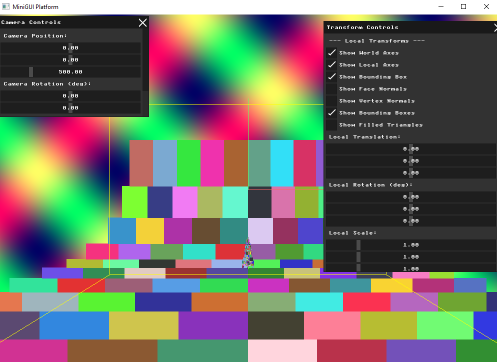
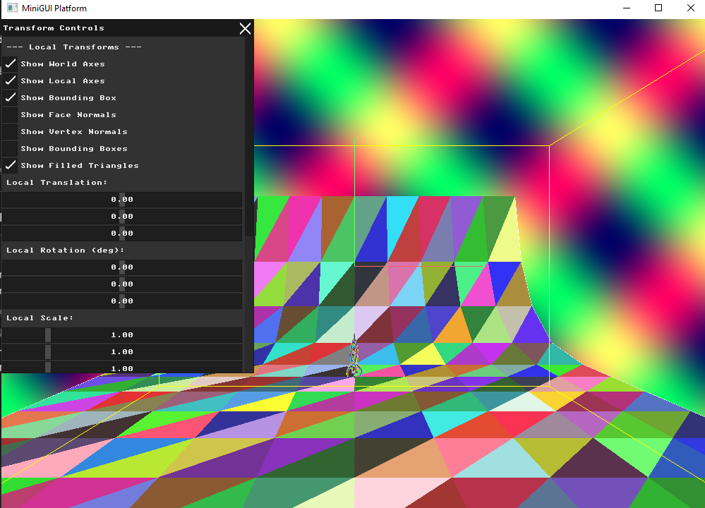
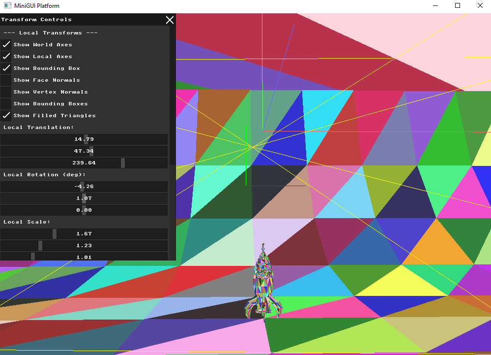
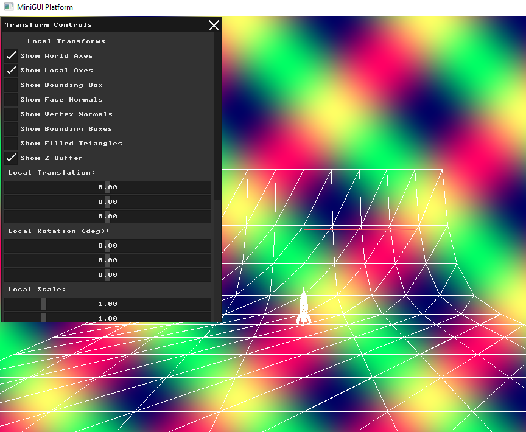
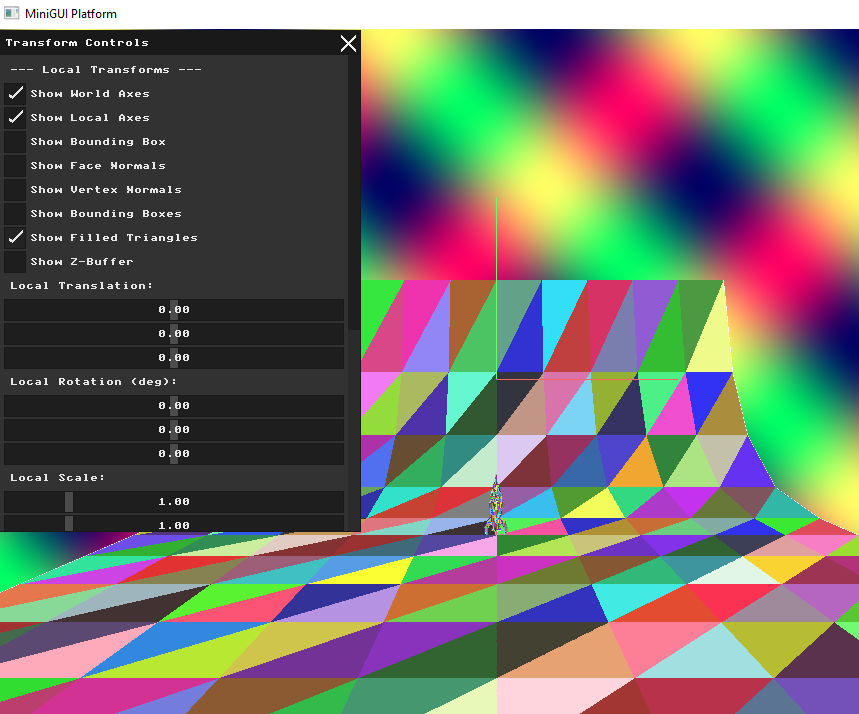
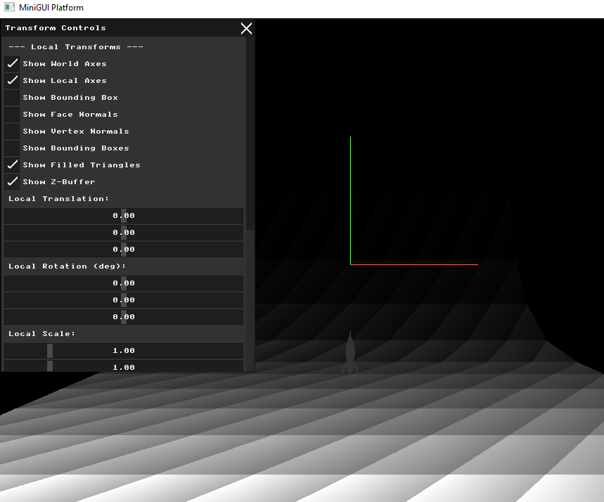

# Assignment: Triangle Rasterization and Depth Buffering

## Overview

Up to this point, your models have been rendered as transparent wireframes. In this assignment, we will finally create solid geometry. You will write a software rasterizer capable of filling 2D triangles with solid colors. Furthermore, you will solve the critical "visibility problem"—ensuring that geometry in the front correctly obscures geometry in the back—by implementing a Z-Buffer.

### Part 1: Bounding Box Rasterization (Debugging)

##### Background: The Rasterization Concept

Rasterization is the process of converting a mathematical vector shape (like a 2D triangle) into discrete pixels on a grid. The simplest, most naive way to fill a shape is to find its 2D bounding box, loop over every single pixel inside that box, and ask: *"Is this pixel inside the triangle?"*

##### Task

Modify the triangle drawing pipeline you built in previous assignments. Instead of drawing the three wireframe edges, calculate the 2D screen-space bounding rectangle for the projected triangle. Draw this bounding rectangle to your `g_buffer`. Assign a random solid color to each triangle's bounding box. You should see a blocky, abstract representation of your 3D model made entirely of overlapping colored rectangles. Add a UI toggle to switch this debug view on and off.

### Part 2: Triangle Filling Algorithms

##### Background: Inside the Triangle

To turn your bounding boxes into actual triangles, you must implement an inclusion test. In this assignment, you will use **Barycentric Coordinates**. This is an elegant mathematical coordinate system: for any pixel $(x, y)$ inside the bounding box, you calculate three weights $(\alpha, \beta, \gamma)$. If all three weights are between $0$ and $1$, the pixel is inside the triangle!

##### Task

Implement the Barycentric Coordinates algorithm to fill your triangles (it is highly recommended to use an AI assistant to help you explore and derive the math behind this coordinate system!). Update your loop from Part 1: for every pixel in the bounding box, calculate its barycentric weights to perform the inclusion test. If the pixel is inside, color it; if it is outside, skip it.

Assign a random color to every face in your mesh. When you render your scene, you should now see a solid, fully filled 3D object!

*Note the visual artifacts:* You will likely see triangles overlapping incorrectly. A triangle from the back of the model might be drawn *on top* of a triangle in the front simply because it was processed later in your loop (the Painter's Algorithm problem).

### Part 3: The Z-Buffer Algorithm

##### Background: Solving the Visibility Problem

To ensure depth is respected at a per-pixel level, graphics hardware uses a **Z-buffer** (or Depth Buffer).
This is a second block of memory identically sized to your color `g_buffer`, but instead of storing ARGB colors, it stores a single floating-point value representing the distance (depth) from the camera to the closest pixel drawn so far. Before coloring a pixel, you check the Z-buffer. If the new pixel is closer to the camera than the value currently in the Z-buffer, you overwrite the color *and* update the Z-buffer. If it is further away, you simply discard it.

##### Task

Create a `float` array to serve as your Z-buffer. At the start of every frame, initialize all values to a very large number (representing infinity/the far clipping plane).

During your triangle rasterization loop, calculate the interpolated Z-depth for the current pixel using your Barycentric coordinates (this is simply $\alpha Z_1 + \beta Z_2 + \gamma Z_3$). Implement the depth test. Your overlapping triangle artifacts from Part 2 should instantly disappear, revealing a perfect, solid 3D model.

Finally, write a visualization mode: Map the raw floating-point values in your Z-buffer to grayscale colors and draw them directly to the screen. You should see a "depth map" of your scene, where closer pixels are darker (or lighter) than pixels further away. Include side-by-side screenshots of the Color Buffer and Z-Buffer in your report.

### Part 4: Pair Programming Extensions

*Students working in pairs are required to complete the following extensions.*

##### 1. Backface Culling

* **Background:** In a closed 3D mesh (like a sphere or a cube), half of the triangles are always facing away from the camera. Drawing them is a complete waste of CPU cycles since the Z-buffer will hide them anyway. **Backface Culling** identifies and discards these triangles before the rasterization loop even begins.

* **Task:** Calculate the dot product between the Triangle's Face Normal and the Camera's View Vector. If the result is positive, the triangle is facing away from the camera. Discard it early. Add a UI toggle to turn Backface Culling on and off. While you won't see a visual difference on a closed model, rendering performance (framerate) should visibly improve.

##### 2. Sub-pixel Precision and Fill Rules

* **Background:** When drawing adjacent triangles that share an edge, floating-point rounding errors often cause pixels exactly on the edge to either be drawn twice, or not at all (creating tiny gaps or "seams" in your model). Modern GPUs solve this using strict Top-Left Fill Rules.

* **Task:** Research the Top-Left Fill Rule (or tie-breaking rules for Barycentric coordinates). Implement edge-tie-breaking in your rasterizer so that shared edges are completely seamless and no pixel is ever drawn twice.

# Submission Report

## Part 1: Bounding Box Rasterization

### Approach
For each triangle in the mesh, I compute the 2D bounding box of its three projected screen-space vertices (min/max X and Y), then fill every pixel inside that rectangle with a unique color per triangle:

```cpp
// Find bounding box
int min_x = std::max(0, std::min({x0, x1, x2}));
int max_x = std::min(WIDTH-1, std::max({x0, x1, x2}));
int min_y = std::max(0, std::min({y0, y1, y2}));
int max_y = std::min(HEIGHT-1, std::max({y0, y1, y2}));

// Fill bounding box with random color per face
uint32_t color = face_color(fi);
for (int y = min_y; y <= max_y; y++) {
  for (int x = min_x; x <= max_x; x++) {
    g_buffer[y * WIDTH + x] = color;
  }
}
```

Each triangle gets a consistent unique color via a hash function:

```cpp
uint32_t face_color(int face_index) {
  int r = (face_index * 73856093) & 0xFF;
  int g = (face_index * 19349663) & 0xFF;
  int b = (face_index * 83492791) & 0xFF;
  return MFB_RGB(std::max(r, 50), std::max(g, 50), std::max(b, 50));
}
```

### What This Shows
The bounding box view clearly demonstrates **why a proper triangle inclusion test is needed** — every pixel inside the rectangular bounding box gets colored, even pixels that fall outside the actual triangle. The overlapping rectangles produce a blocky, abstract representation of the mesh that does not respect true triangle boundaries.

### Result




---

## Part 2: Triangle Filling with Barycentric Coordinates

### Approach
For every pixel inside a triangle's bounding box, I compute barycentric coordinates (α, β, γ) to test whether the pixel actually lies inside the triangle. Only pixels where all three coordinates are non-negative get colored:

```cpp
auto cross2d = [](float ax, float ay, float bx, float by) {
  return ax * by - ay * bx;
};

float denom = cross2d(x1-x0, y1-y0, x2-x0, y2-y0);
if (abs(denom) < 0.0001f) continue; // skip degenerate triangles

for (int y = min_y; y <= max_y; y++) {
  for (int x = min_x; x <= max_x; x++) {
    float alpha = cross2d(x1-x0, y1-y0, x-x0, y-y0) / denom;
    float beta  = cross2d(x2-x1, y2-y1, x-x1, y-y1) / denom;
    float gamma = 1.0f - alpha - beta;

    if (alpha >= 0.0f && beta >= 0.0f && gamma >= 0.0f) {
      g_buffer[y * WIDTH + x] = color;
    }
  }
}
```

### What This Shows
Compared to Part 1, the triangles are now filled with pixel-perfect accuracy — no rectangular artifacts. However, without a depth test, triangles drawn later simply overwrite earlier ones regardless of their actual depth in 3D space, creating visible ordering artifacts (some triangles appear in front of others incorrectly).

---

## Part 3: Z-Buffer Depth Testing

### Approach
I added a second buffer `g_zbuffer` (same dimensions as `g_buffer`) initialized to `FLT_MAX` each frame. Before writing any pixel, I interpolate the depth value using barycentric coordinates and compare it against the stored depth:

```cpp
// Interpolate depth
float depth = alpha * z0 + beta * z1 + gamma * z2;

// Z-buffer test: only draw if closer than what's already there
int idx = y * WIDTH + x;
if (depth < g_zbuffer[idx]) {
  g_zbuffer[idx] = depth;
  g_buffer[idx] = color;
}
```

### Z-Buffer Visualization
I also implemented a grayscale depth map visualization — the stored Z values are normalized across the full depth range and mapped to brightness (closer = brighter, further = darker):

```cpp
uint8_t gray = (uint8_t)(255.0f * (1.0f - (g_zbuffer[i] - min_z) / range));
g_buffer[i] = MFB_RGB(gray, gray, gray);
```

### What This Shows
With the Z-buffer enabled, triangles are correctly ordered by depth — closer triangles always appear in front of further ones regardless of draw order. The depth map visualization clearly shows the 3D structure of the scene, with the rocket appearing as a brighter (closer) region against the darker (further) ground plane.

### Result


