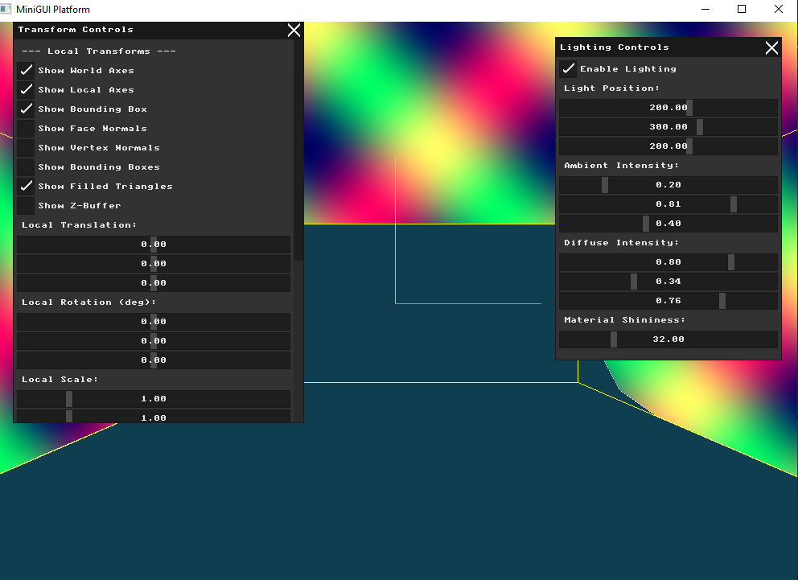
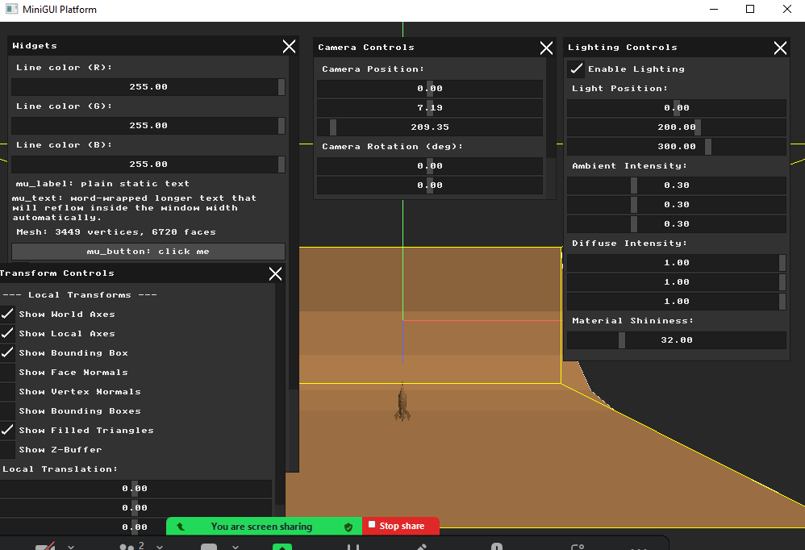
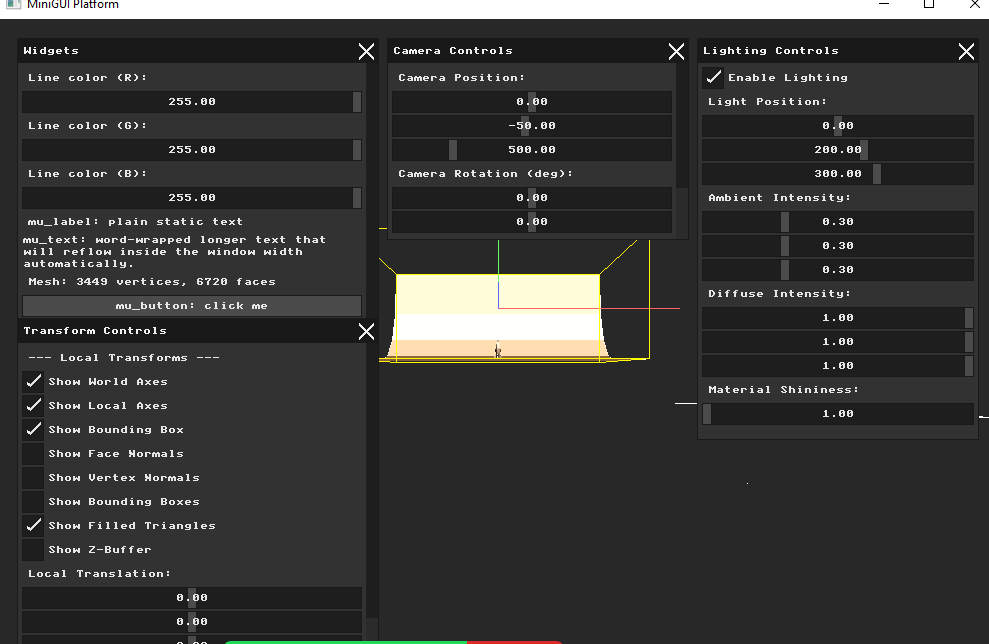
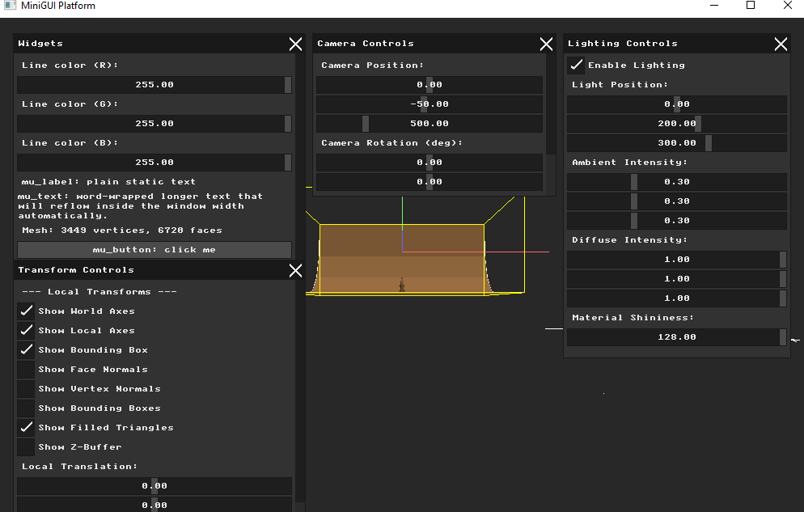
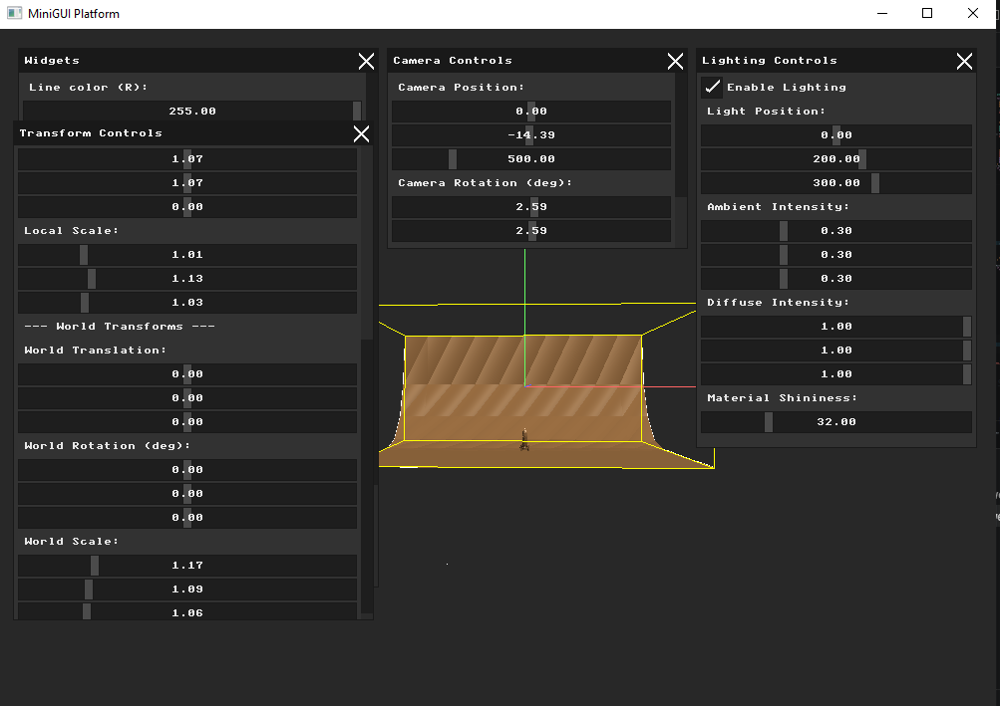

# Assignment: Lighting, Materials, and Shading

## Overview

Our solid models currently look flat and artificial. In the real world, our perception of 3D shape comes from how light interacts with surfaces. In this final assignment, you will implement the classic **Phong Reflection Model**, calculate the interaction between virtual lights and surface normals, and use interpolation to create smooth, realistic shading.

### Part 1: Light Sources and Material Properties

##### Background: The Reflection Model

In classic graphics pipelines, light is simulated by calculating three distinct components:

1. **Ambient:** A constant base level of light that illuminates all objects equally, simulating light bouncing around the environment.

2. **Diffuse:** Directional light that scatters in all directions upon hitting a rough surface. Its intensity depends on the angle between the light and the surface.

3. **Specular:** Bright, concentrated highlights caused by light reflecting directly into the camera from a shiny surface.

Objects also have **Materials** that dictate how they respond to these lights. A red plastic ball reflects red diffuse light and white specular light.

##### Task

Create a `PointLight` struct containing a 3D position and three RGB color components (Ambient, Diffuse, Specular). Create a `Material` struct containing corresponding RGB properties.
Add a UI panel to control the Light's position $(X,Y,Z)$ and its color intensities.
Implement just the **Ambient** lighting calculation (multiplying the light's ambient color by the material's ambient color) and render the scene. The object will look entirely flat, but should respond to your UI color changes.

### Part 2: Flat Shading (Diffuse Lighting)

##### Background: Lambert's Cosine Law

Diffuse lighting relies on **Lambert's Cosine Law**: the brightness of a surface is proportional to the cosine of the angle between the surface normal and the direction of the light source. Mathematically, this is achieved by taking the **Dot Product** of the normalized Light Direction vector and the normalized Face Normal vector.

##### Task

Calculate the Diffuse component for each triangle. To do this using **Flat Shading**, calculate the lighting equation *once* per triangle using the Face Normal and the center point of the triangle. Add this Diffuse result to your Ambient result. Your model will now have shading, but will look heavily faceted, like a jewel or a low-poly aesthetic, because every pixel on a given triangle receives the exact same color.

### Part 3: Specular Highlights

##### Background: The Reflection Vector

To simulate shininess, we must calculate the Specular component. This requires knowing the direction the light *reflects* off the surface, and comparing it to the direction of the *Camera* (the View vector). If the reflected light points straight into the camera, we draw a bright highlight.

##### Task

Implement a function to compute the Reflection vector of the light against the surface normal. Use this vector, along with the View vector and the material's "shininess" exponent, to calculate the Specular component. Add this to the Ambient and Diffuse components.
To verify your math, use your `draw_line` function to draw both the incoming Light Vector and the outgoing Reflection Vector from the center of a few faces on your model. Include a screenshot of these debug vectors in your report.

### Part 4: Phong Shading (Per-Pixel Shading)

##### Background: Interpolating Normals

Flat shading looks unrealistic for curved surfaces (like spheres). To make a blocky mesh look perfectly smooth, we must calculate the lighting equation for *every single pixel* rather than once per face. This is called **Phong Shading**.

To do this, we don't use the Face Normal. Instead, we take the three **Vertex Normals** of the triangle, and use the exact same Barycentric Coordinates we used for rasterization to *interpolate* a brand new normal for the specific pixel we are currently drawing.

##### Task

Modify your rasterization loop. For every pixel:

1. Interpolate the 3D position of the pixel using barycentric weights.

2. Interpolate the normal of the pixel using barycentric weights.

3. Normalize the newly interpolated normal vector.

4. Calculate the full Ambient + Diffuse + Specular lighting equation using these interpolated values.

Render the result. Your jagged, low-poly model should now look incredibly smooth and realistically lit!

### Part 5: Pair Programming Extensions

*Students working in pairs are required to complete the following extensions.*

##### 1. Gouraud Shading

* **Background:** Phong shading (per-pixel) is computationally expensive. Before hardware was fast enough to do this, games used **Gouraud Shading**. In Gouraud shading, the expensive lighting equation is calculated only three times—once for each vertex. The resulting *colors* are then interpolated across the face using barycentric coordinates.

* **Task:** Implement Gouraud shading as an intermediate option. Add a UI dropdown to let the user switch in real-time between Flat Shading, Gouraud Shading, and Phong Shading. Compare the visual quality of the specular highlights between Gouraud and Phong in your report.

##### 2. Texture Mapping

* **Background:** Instead of assigning a solid color material to an object, we can wrap a 2D image (texture) around it. This requires reading $U, V$ texture coordinates assigned to each vertex.

* **Task:** Extend your `.obj` loader to read `vt` (texture coordinate) data. Load a simple `.bmp` or `.png` file into a 1D pixel array in memory. During rasterization, use your barycentric coordinates to interpolate the $U, V$ values at the current pixel. Use these $U, V$ values to look up the exact color from the texture array and apply it to the Diffuse component of your lighting equation.

# Submission Report

## Part 1: Light Sources and Material Properties (Ambient Lighting)

### Approach
I defined two new structs — `PointLight` and `Material` — to hold the lighting and material properties:

```cpp
struct PointLight {
  glm::vec3 position;
  glm::vec3 ambient;
  glm::vec3 diffuse;
  glm::vec3 specular;
};

struct Material {
  glm::vec3 ambient;
  glm::vec3 diffuse;
  glm::vec3 specular;
  float shininess;
};
```

I added a **Lighting Controls** UI window with sliders for light position, ambient intensity, diffuse intensity, and material shininess. For Part 1, only the ambient component is applied:

```cpp
glm::vec3 ambient = g_light.ambient * g_material.ambient;
glm::vec3 result = glm::clamp(ambient, 0.0f, 1.0f);
color = MFB_RGB((uint8_t)(result.r*255), (uint8_t)(result.g*255), (uint8_t)(result.b*255));
```

The ambient component represents light that bounces uniformly from all directions — it ensures no part of the model is completely black even when facing away from the light source. Adjusting the ambient intensity sliders changes the flat base color of the entire model uniformly.

### Result


---

## Part 2: Flat Shading with Diffuse Lighting

### Approach
I added **Lambert diffuse lighting** — computed once per triangle using the face normal. The diffuse component models how much light hits a surface based on the angle between the surface normal and the light direction:

```cpp
// Transform normal to view space
glm::mat3 normal_mat = glm::mat3(V * glm::mat4(glm::mat3(M_world * M_local)));
glm::vec3 n = glm::normalize(normal_mat * g_face_normals[fi]);

// Fixed directional light
glm::vec3 light_dir = glm::normalize(glm::vec3(0.3f, 0.8f, 0.5f));

// Lambert diffuse (abs to light both front and back faces)
float diff = std::max(0.0f, glm::dot(n, light_dir));
diff = std::max(diff, std::max(0.0f, glm::dot(-n, light_dir)) * 0.5f);

float ambient = 0.2f;
float brightness = ambient + (1.0f - ambient) * diff;
glm::vec3 result = glm::vec3(0.7f, 0.5f, 0.3f) * brightness;
```

Since one lighting value is computed per **triangle** (using the face normal), each triangle renders as a single flat color. This produces the characteristic **faceted/low-poly look** of flat shading — visible triangle boundaries with sharp color jumps between adjacent faces.

### Result


---

## Part 3: Specular Highlights

### Approach
I added a **Phong specular component** on top of the diffuse lighting. Specular highlights simulate the bright shiny spot that appears when light reflects directly toward the camera:

```cpp
// View direction (camera looks down -Z in view space)
glm::vec3 view_dir = glm::vec3(0.0f, 0.0f, 1.0f);

// Reflect light direction around surface normal
glm::vec3 reflect_dir = glm::reflect(-light_dir, n);

// Specular intensity: dot product raised to shininess power
float spec = pow(std::max(0.0f, glm::dot(reflect_dir, view_dir)),
                 g_material.shininess);

// Combine ambient + diffuse + specular
glm::vec3 result = base_color * (ambient + diff * 0.7f)
                 + glm::vec3(1.0f, 1.0f, 1.0f) * spec * 0.8f;
```

The **shininess exponent** controls the size and sharpness of the highlight:
- **Low shininess (1–10):** Large, soft, spread-out highlight — simulates a rough/matte surface
- **High shininess (64–128):** Small, tight, bright spot — simulates a polished/glossy surface

The specular highlight color is white regardless of material color — this simulates the light color dominating at the point of direct reflection.

### Result



---

## Part 4: Phong Shading (Per-Pixel Smooth Lighting)

### Approach
In Parts 2 and 3, lighting was computed once per triangle using the face normal — producing flat, faceted shading. **Phong shading** moves the lighting computation **inside the pixel loop**, interpolating vertex normals across each triangle using barycentric coordinates:

```cpp
// Get transformed vertex normals
glm::mat3 normal_mat = glm::mat3(V * glm::mat4(glm::mat3(M_world * M_local)));
glm::vec3 vn0 = glm::normalize(normal_mat * g_vertex_normals[face.v0]);
glm::vec3 vn1 = glm::normalize(normal_mat * g_vertex_normals[face.v1]);
glm::vec3 vn2 = glm::normalize(normal_mat * g_vertex_normals[face.v2]);

// Per-pixel: interpolate normal using barycentric coordinates
glm::vec3 n = glm::normalize(alpha * vn0 + beta * vn1 + gamma * vn2);

// Compute full lighting (ambient + diffuse + specular) per pixel
float diff = std::max(0.0f, glm::dot(n, light_dir));
glm::vec3 reflect_dir = glm::reflect(-light_dir, n);
float spec = pow(std::max(0.0f, glm::dot(reflect_dir, view_dir)),
                 g_material.shininess);
glm::vec3 result = base_color * (ambient + diff * 0.7f)
                 + glm::vec3(1.0f, 1.0f, 1.0f) * spec * 0.8f;
```

### Flat Shading vs Phong Shading
| | Flat Shading | Phong Shading |
|---|---|---|
| Normal used | One face normal per triangle | Interpolated vertex normal per pixel |
| Color per triangle | One flat color | Varies smoothly across triangle |
| Visual result | Faceted, sharp triangle edges visible | Smooth, rounded appearance |
| Performance | Fast (one lighting calc per triangle) | Slower (one lighting calc per pixel) |

The key insight is that vertex normals (averaged from adjacent face normals) represent the smooth underlying surface geometry. By interpolating them across each triangle, we can approximate smooth curved surfaces even with a coarse triangle mesh.

### Result
